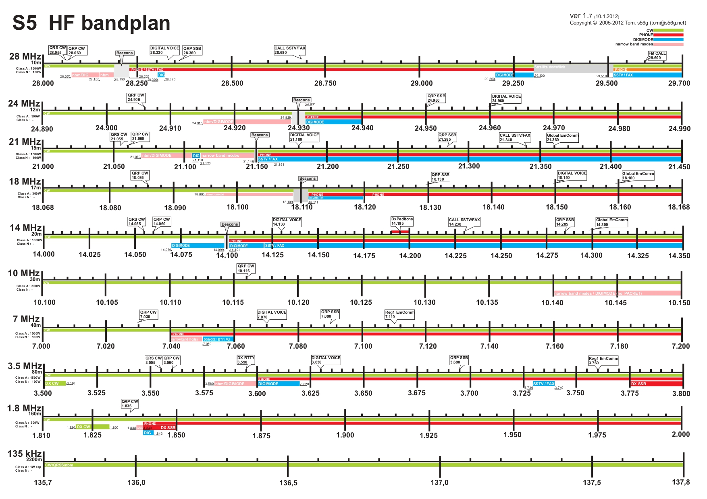

## 2. Radijske komunikacije

----

### Osnovni pojmi o radijskih komunikacijah

**TELEKOMUNIKACIJE** – vsak **prenos, oddaja ali sprejem signalov**, pisanih besedil, slik ali zvokov ali kakršnihkoli drugih sporočil **po žičnih, radijskih, optičnih** ali drugih elektromagnetnih sistemih.

Lahko so:
- Obojesmerne med udeleženci
- Enosmerne za več udeležencev (DIFUZIJA)

**Radijski valovi – elektromagnetni valovi, ki imajo frekvence nižje od 3 THz oziroma valovne dolžine daljše od 0.1 mm.**

Praktično se uporabljajo valovi od 9 kHz do 300 GHz

**ITU** – International Telecomunications Union

Ukvarja se s tehničnim napredkom in razvojem telekomunikacij, mednarodnim sodelovanjem, …

**Deluje v okviru OZN** (Združenih Narodov)  
**Sedež je v Ženevi**, Švica

**Ustanovljena 1865**

**Slovenija postala članica 1992**

**ITU pravilnik o radiokomunikacijah** – ureja celotno področje radijskih komunikacij:

- Vrste radiokomunikacijskih služb
- Razporeditev radijskih frekvenc
- Definicije moči in anten
- Pravila za vzpostavljanje radijskih zvez
- Klicne znake radijskih postaj
- Dokumente za radijske postaje
- &hellip;

**Radijska postaja – en ali več oddajnikov oziroma
sprejemnikov s pripadajočimi napravami na
enem mestu, ki so potrebne za opravljanje
radiokomunikacijeske službe.**

- Sestavljajo samo oddajniki oz. samo sprejemniki
- Pripadajoče naprave so del postaje (antene, …)
- Poznamo kombinacijsko postajo (transceiver)

**Radiokomunikacijska služba – služba, ki vključuje
prenos, oddajo in/ali sprejem radijskih valov v
posebne telekomunikacijske namene.**

Poznamo jih 10 – tukaj jih je nekaj:
- Radiofuzna služba in radiofuzna satelitska služba
- Zrakoplovna služba in zrakoplovna satelitska služba
- Pomorska služba in pomorska satelitska služba
- Kopenska služba in kopenska satelitska služba
- <u>Amaterska služba in amaterska satelitska služba</u>

**Amaterska služba – radiokomunikacijska služba
(dejavnost), s katero se ukvarjajo amaterji –
ustrezno pooblaščene osebe, ki se izključno iz
osebnih pobud in brez pridobitniških namenov
zanimajo za radiotehniko, in katere je namen
samoizobraževanje, medsebojno komuniciranje in
tehnične raziskave.**

&nbsp;

**Amaterska satelitska služba** - radiokomunikacijska služba (dejavnost), ki uporablja **vesoljske postaje na Zemljinih satelitih za iste namene kot amaterksa služba.**

**Amaterska radijska postaja** – **radijska postaja v
radioamaterski dejavnosti**, namenjena za
medsebojno komuniciranje, samoizobraževanje,
in tehnično raziskovanje, ki ga opravljajo
radioamaterji izključno iz osebnih nagibov, brez
materialnih koristi in imajo opravljen izpit.

&nbsp;

CB postaje (Citizen Band) ne spadajo v radioamatersko
dejavnost – zakone določa država.

----

### Radioamaterska razdelitev sveta

#### IARU / ITU Regioni
- **1\. region**: EU, AF, del Azije
- 2\. region: Ameriki in Grenlandija
- 3\. region: ostali del Azije, Avstralija, Nova Zelandija

#### ITU območja (cone)
- Slovenija je v **28.**

#### CQ območja (cone)
- Slovenija je v **15.**

### Mednarodna razdelitev radijskih frekvenc

Razdelitev radijskih frekvenc določa IARU. Vsak region ima svojo razdelitev frekvenc.

$$ \text{valov. dolž.} = \frac{3 \cdot 10^8 \frac{m}{s}}{\text{frekv.}} $$

- [S5 Band Plans](https://www.radioamater.si/dejavnosti/s5-band-plans/)
- [IARU Region 1 Band plans](https://www.iaru-r1.org/reference/band-plans/)
- [Splošni akt - 4. člen](http://www.pisrs.si/Pis.web/pregledPredpisa?id=AKT_857)

