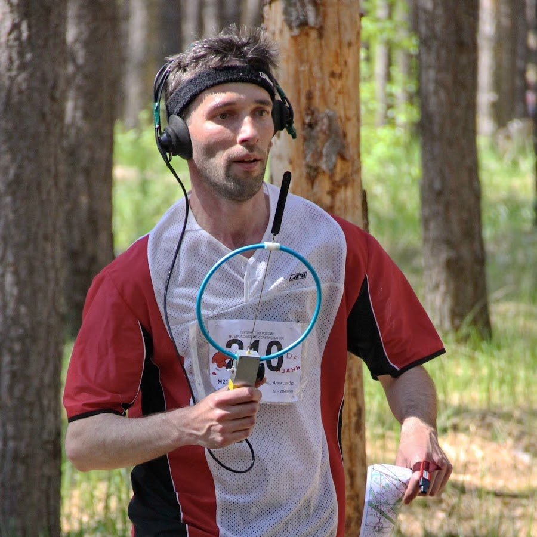

## 4. Pravila in praksa  v amaterskih radijskih komunikacijah

----

###  Vspostavljanje amaterskih radijskih zvez

----

### Načini vzpostavljanja zvez

**Telegrafija (CW)** – uporablja se Morzejeva
abeceda. Prenaša se znak po znak, uporabljajo se
kratice. Hitrosti oddajanja med 25 do 200 znakov na
minuto.

### Načini vzpostavljanja zvez

**Telefonija (Phone)** – zveze, vzpostavljene v
govornem jeziku, ki ga poznata oba sogovornika. Za
slabše povezave uporabljamo tablice črkovanja.

### Načini vzpostavljanja zvez

**Ostale zveze:**
- SSTV – slow scan television – mirujoče slike
- FSTV – fast scan television – gibljive slike
- ATV – amateur television – gibljive slike
- Digitalne komunikacije:
    - **FT8** / FT4
    - RTTY
    - AMTOR
    - PACKET RADIO
    - &hellip;

----

### Klicni znaki

**Klicni znak** – oznaka, sestavljena iz črk in/ali številk, s
katero se radijska postaja indentificira. Oblika klicnega
znaka je predpisana v ITU RR.

<b>S5 9VEG</b>

- S5 &rarr; **Prefiks** &rarr; "Država"  
- 9VEG &rarr; **Sufiks** &rarr; Postaja znotraj "države"

##### Prefiksi
<table class="tc compact">
<tr><td>S5</td><td>Slovenija</td></tr>
<tr><td>9A</td><td>Hrvaška</td><td>I</td><td>Italija</td></tr>
<tr><td>OE</td><td>Avstrija</td><td>HA</td><td>Madžarska</td></tr>
<tr><td>F</td><td>Francija</td><td>DA-DR</td><td>Nemčija</td></tr>
<tr><td>EA</td><td>Španija</td><td>G M &hellip;</td><td>Anglija</td></tr>
</table>

Dolžina: 3-6 znakov

Zapis serije znakov: GAA-GZZ → G2BB, G3SX, G8VG

**Pripone:**

<strong>/M</strong>
– <strong>mobilna</strong> (mobile) postaja (v vozilu)

<strong>/MM</strong>
– <strong>pomorska</strong> mobilna (maritime mobile) postaja (čoln)

<strong>/AM</strong>
– <strong>zrakoplovna</strong> mobilna (aeronautical mobile) postaja

<strong>/P</strong>
– <strong>prenosna</strong> (portable) postaja

 

Primer: S59VEG/**MM** &rarr; Postaja S59VEG oddaja s čolna (MM)

[Razpoznavanje klicnih znakov](https://cq.jkob.cc/#/callsign)

----

### Q-kod

- **Dolge 3 znake**
- **Začnejo se s Q**
- Uporabljajo jih tudi druge radiokomunikacijske službe

Lahko se uporablja v obliki vprašanja in odgovora:

QRV? QRV

Ali si pripravljen? Pripravljen sem.

QRL? QRL

Ali imaš zvezo? Imam zvezo (ne moti)

QRU? QRU

Imaš kaj zame? Nimam nič zate.

Kodam dodajamo tudi argumente?

QRG 21125

Tvoja točna frekvenca je 21125 kHz

QRB 10

Razdalja med postajama je 10 km

QRW S50XXX 21125

Obvesti S50XXX, da ga kličem na frekvenci 21125 kHz

 

**Q–kod se v telefoniji** _načeloma_ **ne uporablja!**

Vse Q–kode v priročniku na strani 247 - 248

<table class="compact">
<tr><th>Q-koda</th><th>Vprašanje</th><th>Odgovor</th></tr>
<tr><td>QRK</td><td>Kakšna je razumljivost mojega signala?</td><td>Razumljivost tvojega signala je … (1-5).</td></tr>
<tr><td>QRM</td><td>Ali te motijo druge postaje?</td><td>Motijo me druge postaje.</td></tr>
<tr><td>QRN</td><td>Te moti statika?</td><td>Moti me statika.</td></tr>
<tr><td>QRO</td><td>Naj povečam oddajno moč?</td><td>Povečaj oddajno moč.</td></tr>
<tr><td>QRP</td><td>Naj zmanjšam oddajno moč?</td><td>Zmanjšaj oddajno moč.</td></tr>
<tr><td>QRS</td><td>Naj oddajam počasneje?</td><td>Oddajaj počasneje.</td></tr>
<tr><td>QRT</td><td>Naj preneham z oddajanjem?</td><td>Prenehaj z oddajanjem.</td></tr>
<tr><td>QRZ</td><td>Kdo me kliče?</td><td>Kliče te …</td></tr>
<tr><td>QRV</td><td>Si pripravljen?</td><td>Pripravljen sem.</td></tr>
<tr><td>QSB</td><td>Ali moj signal niha?</td><td>Tvoj signal niha.</td></tr>
<tr><td>QSL</td><td>Lahko potrdiš sprejem?</td><td>Potrjujem sprejem.</td></tr>
<tr><td>QSO</td><td>Ali lahko komuniciraš z … direktno?</td><td>Z … lahko komuniciram direktno.</td></tr>
<tr><td>QSY</td><td>Ali naj se premaknem z oddajanjem na drugo frekvenco?</td><td>Pomakni se z oddajanjem na drugo frekvenco.</td></tr>
<tr><td>QRX</td><td>Kdaj me boš ponovno poklical?</td><td>Ponovno te bom poklical ob … uri na … kHz (MHz).</td></tr>
<tr><td>QTH</td><td>Kje je tvoja lokacija?</td><td>Moja lokacija je …</td></tr>
</table>

----

### RST sistem (RST - kod)

Tri zaporedne številke:
- R &ndash; **Razumljivost** (Readability) (1-5)  
- S &ndash; **Jakost** (Strenght) (1-9)  
- T &ndash; **Ton** (Tone) (1-9)

**V telefoniji** se uporabljata **samo RS**.

Sistem se uporablja kot povratna informacija pošiljatelju.  
Rečemo mu tudi raport (report).

Na modernih postajah pa je vgrajen tudi S-meter.

Primer:
>RST je **558**  
>Razumljivost je odlična (**5**/5)  
>Moč signala je srednja (**5**/9)  
>Ton je skoraj popoln (**8**/9)

----

### Kratice

Uporabljajo se v **telegrafiji**.  
Če je kratica nadčrtana, jo pošljemo kot en znak (brez presledkov med črkami).

<o>KA</o>

– začetek zveze

<o>VA</o> ali <o>SK</o>

– konec zveze

<o>VA</o> CL

– konec zveze in izključi postajo

<o>AR</o> ali +

– konec sporočila

<o>AR</o> K

– konec sporočila in pripravljen na sprejem

<o>AR</o> <o>KN</o>

- konec sporočila in pripravljen na sprejem samo klicane postaje

CQ

– splošni poziv vsem postajam

CFM

– potrjujem

GD

– Good day (dober dan)

CS

– klicni znak

DR

– Dear (dragi, draga)

DE

– tukaj, od (klicatelja)

PSE

– prosim

NW

– zdaj (now)

DX

– Oddaljen; daleč stran

TFC

– promet (trafic)

OM

– old man (star prijatelj)

TU

– hvala

R

– sprejeto

Vse kratice so v priročniku na strani 249-256

Primer zveze:

>CQ CQ CQ DE S59VEG S59VEG CQ K  
>S59VEG DE S50HQ K  
>S50HQ S59VEG GD OM UR RST 599 599 QSL? K  
>S59VEG S50HQ QSL TU FER 599 UR 589 589 K  
>S50HQ S59VEG TU UR WX? K  
>&hellip;

----

## Amaterske zveze v telegrafiji

----

### Morse-kod

Samuel Morse 1791-1872

1835 objavil žični elektromagnetni telegraf in sistem
pretvorbe besedila – Morzejevo abecedo

Kasneje sprejet mednarodni morse kod, ki se danes
uporablja v telegrafiji

Prva javna zveza leta 1844 (Washington – Baltimore)  
Po iznajdbi radia govorimo o **radiotelegrafiji**

**Dolžina posameznih elementov Morse-koda je
točno določena  
(1 enota označena z e):**
- Kratek impulz _"dit"_ (&bull;) - 1e
- Dolg impulz _"dah"_ (&ndash;) - 3e
- Premor med impulzi v znaku - 1e
- Premor med znaki v besedi - 3e
- Premor med besedami - 7e

----

### Vsebina zveze

Vsaka radijska zveza je sestavljena iz več relacij.
Relacija je del zveze, ki jo odda eden od operaterjev.

**Relacije:**  
1. Klicanje  
2. Vzpostavitev zveze  
3. Izmenjava ostalih podatkov  
4. Zaključek zveze

#### Klicanje

**Poziv k zvezi** (s splošnim klicom **CQ**)

Primer klica:
>CQ CQ CQ DE S59VEG S59VEG K

Primer klica kontinenta/države/DX postaje:
>CQ CQ **EU EU** DE S59VEG S59VEG K  
>CQ CQ **9A 9A** DE S59VEG S59VEG K  
>CQ CQ **DX DX** DE S59VEG S59VEG K

#### Klicanje

**DX – oddaljena zveza** (za Slovenijo):
- HF – vse izven Evrope
- VHF/UHF/SHF – razdalja se niža odvisno od frekvenčnega pasu (pri 144 Mhz je 400 in 500km)

**Klicanje na tekmovanjih:**

_TEST_ (**&ndash; &sdot; &sdot;&sdot;&sdot; &ndash;**) je kratica za contest.

>CQ **TEST** S59VEG S59VEG K

Ali še hitreje:

>S59VEG S59VEG TEST

#### Klicanje

Primer odgovora na poziv:
>K1ZZ K1ZZ DE S59VEG S59VEG S59VEG <o>AR</o> K

Če smo klicali na frekvenci namenjeni za klicanje, se po vspostavljeni zvezi navadi premaknemo na drugo frekvenco.

#### Vzpostavitev zveze

Ko sprejmemo odziv, začnemo z uvodno relacijo.

**Deli relacije:**  
1. Tuj klicni znak, DE, svoj klicni znak  
2. Zahvala za klic  
3. RST ocena  
4. Povemo svoje ime, lahko tudi lokacijo (QTH)  
5. Zaključimo relacijo

Posamezne dele ločimo z **=** oziroma **&ndash;&sdot;&sdot;&sdot;&ndash;** ali **&ndash;&sdot;&sdot;&sdot;&sdot;&ndash;**

#### Vzpostavitev zveze

Primer:

>S59XXX DE S59VEG = HLO ES TNX FER CALL = UR RST IS 599 599 = MY NAME IS JANEZ = <o>AR</o> S59XXX DE S59VEG <o>KN</o>

>S59VEG DE S59XXX = HLO ES UR WELCOME = UR RST IS 599 599 = MY NAME IS FRANCI = <o>AR</o> S59XXX DE S59VEG <o>KN</o>

#### Izmenjava ostalih podatkov

**Deli relacije:**  
1. Tuj klicni znak, DE, svoj klicni znak  
2. Podatki, ki jih želimo izmenjati  
3. Zaključimo relacijo

**Primer:**  
>S50XXX DE S59VEG = PSE HW? = <o>AR</o> S59XXX DE S59VEG <o>KN</o>

#### Zaključek zveze

**Deli zaključne relacije:**  
1. Tuj klicni znak, DE, svoj klicni znak  
2. Odslovilno besedilo  
3. Zaključimo relacijo

Primer:  
>S50XXX DE S59VEG = DR FRANCI TNX FER NICE QSO ES HPE CUAGN = <o>AR</o> S59XXX DE S59VEG <o>SK</o>

Nekaj nasvetov za dobro CW delo:
- Pred oddajanjem poslušajte frekvenco, oddate QRL? in čakate odgovor
- Oddajajte kratke CQ; če po 3 ali 4 klicih ni odziva, zamenjajte frekvenco
- Držite se pravil in vrstnega reda radijske zveze
- Spoštujte radioamaterski bonton

----

### Amaterske zveze v telefoniji

----

### Vsebina zveze

**Zveze potekajo v skupnem pogovornem jeziku (z tujimi radioamaterji največkrat v angleščini).**

V zvezah se kratice in Q-kod praviloma ne uporablja, vendar to ne pomeni da se ne bodo.

Komunikacija poteka po istem kopitu kot pri telegrafiji.

>S50XXX, S50XXX kliče te S59VEG, S59VEG, prosim, pridi (odzovi se)

>S50XXX S50XXX this is S59VEG calling and listening

----

### Mednarodna in slovenska tablica črkovanja

<table class="tc compact">
<tr><td>A</td><td>ALPHA</td><td>N</td><td>NOVEMBER</td></tr>
<tr><td>B</td><td>BRAVO</td><td>O</td><td>OSCAR</td></tr>
<tr><td>C</td><td>CHARLIE</td><td>P</td><td>PAPA</td></tr>
<tr><td>D</td><td>DELTA</td><td>Q</td><td>QUEBEC</td></tr>
<tr><td>E</td><td>ECHO</td><td>R</td><td>ROMEO</td></tr>
<tr><td>F</td><td>FOXTROT</td><td>S</td><td>SIERRA</td></tr>
<tr><td>G</td><td>GOLF</td><td>T</td><td>TANGO</td></tr>
<tr><td>H</td><td>HOTEL</td><td>U</td><td>UNIFORM</td></tr>
<tr><td>I</td><td>INDIA</td><td>V</td><td>VICTOR</td></tr>
<tr><td>J</td><td>JULIET</td><td>W</td><td>WHISKEY</td></tr>
<tr><td>K</td><td>KILO</td><td>X</td><td>X-RAY</td></tr>
<tr><td>L</td><td>LIMA</td><td>Y</td><td>YANKEE</td></tr>
<tr><td>M</td><td>MIKE</td><td>Z</td><td>ZULU</td></tr>
</table>

<table class="tc compact">
<tr><td>A</td><td>ANKARAN</td><td>O</td><td>ORMOŽ</td></tr>
<tr><td>B</td><td>BLED</td><td>P</td><td>PIRAN</td></tr>
<tr><td>C</td><td>CELJE</td><td>R</td><td>RAVNE</td></tr>
<tr><td>Č</td><td>ČATEŽ</td><td>S</td><td>SOČA</td></tr>
<tr><td>D</td><td>DRAVA</td><td>Š</td><td>ŠMARJE</td></tr>
<tr><td>E</td><td>EVROPA</td><td>T</td><td>TRIGLAV</td></tr>
<tr><td>F</td><td>FALA</td><td>U</td><td>UNEC</td></tr>
<tr><td>G</td><td>GORICA</td><td>V</td><td>VELENJE</td></tr>
<tr><td>H</td><td>HRASTNIK</td><td>Z</td><td>ZALOG</td></tr>
<tr><td>I</td><td>IZOLA</td><td>Ž</td><td>ŽALEC</td></tr>
<tr><td>J</td><td>JADRAN</td><td>Q</td><td>QUEEN</td></tr>
<tr><td>K</td><td>KAMNIK</td><td>W</td><td>DVOJNI V</td></tr>
<tr><td>L</td><td>LJUBLJANA</td><td>X</td><td>IKS</td></tr>
<tr><td>M</td><td>MARIBOR</td><td>Y</td><td>IPSILON</td></tr>
<tr><td>N</td><td>NANOS</td><td></td><td></td></tr>
</table>

<table class="tc compact">
<tr><td>1</td><td>UNAONE</td><td>6</td><td>SOXISIX</td></tr>
<tr><td>2</td><td>BISSOTWO</td><td>7</td><td>SETTESEVEN</td></tr>
<tr><td>3</td><td>TERRATHERE</td><td>8</td><td>OKTOEIGHT</td></tr>
<tr><td>4</td><td>KATEFOUR</td><td>9</td><td>NOVENINE</td></tr>
<tr><td>5</td><td>PANTAFIVE</td><td>0</td><td>NADAZERO</td></tr>
<tr><td>,</td><td>DECIMAL</td><td>.</td><td>STOP</td></tr>
</table>

----

### Amaterske digitalne komunikacije

----

### MGM

**Machine Generated Modes**

Zajema vse sedanje in bodoče vrste digitalnih komunikacij.

Na frekvenčnem pasu je že določen pas namenjen MGM-ih

----

### RTTY

Teleprinter + radijska postaja = **Radijski teleprinter**

Logične 1 in 0 se prenašajo po ločenih frekvencah
- Frekvenci se razlikujeta za 170, 200, 425 ali 850 Hz

Besedilo kodiramo v zaporedje bitov. Kodni tabeli:  
- **BAUDOT** (5 bitni kod &rarr; 32 znakov)  
- **ASCII** (7 bitni + 1 paritetni &rarr; 128 znakov)

Variacije:
- **AMTOR** – RTTY s preverjanjem napak
- **PACTOR** – AMTOR s stiskanjem

----

### PSK31

Namenjen živi tipkovnica-tipkovnica komunikaciji

 

Uporablja PSK (Phase-Shift Keying) kodiranje in DPS (digitalno procesiranje signala)

Največja hitrost je 31 baudov

Dolžina znakov je različna

----

### WSJT-X

Program za "šibko-signalne" radioamaterske zveze

- **FT8** / FT4
- MSK144 / FSK441 (odboj od meteornih sledi - MS)
- JT65 (odboj od lune - EME)
- WSPR
- &hellip;

----

### Packet radio

Povezovanje računalnikov med seboj za hitrejšo izmenjavo informacij.

**MODEM** – MOdulator DEModulator (pretvorba analognih v digitalne signale)

Radioamatersko omrežje, ki deluje po **protokolu AX.25**

**CSMA** (Carier Sence Multiple Access) – algoritem
za prepoznavo **zaznave trkov**

 

Omrežje pokriva praktično cel svet, zato je potrebna neka infrastruktura.

**Paketno vozlišče** – računalnik, ki je preko radijskih postaj povezan z drugimi vozlišči, ta pa usmerja podatke med omrežji.

Storitve:
- Dostop do podatkovnih baz (Keplerjeve elemente, …)
- **BBS (Bulleting Board System)**
- Pošiljanje elektronske pošte
- Vzpostavljanje zvez
- Prehod med različnimi omrežji
- &hellip;

----

### APRS

**Automatic Packet Reporting System**  
Včasih: Automatic Position Reporting System  
Uporablja AX.25 protokol

EU frekvenca: 144,800 / 432,500 MHz

Osnovne funkcije:
- Izris geografske lokacije
- Telemetrija
- Javljanje meteoroloških podatkov
- Izmenjava sporočil med udeleženci v omrežju
- &hellip;

----

## Amaterske SSTV in FSTV zveze

----

### SSTV

- prenos **mirujočih slik** na daljavo
- barvne ali črnobele
- SSB ali FM postaja

----

### FAX

**Faksimile**

Prenos mirujočih **črno-belih ali barvnih** pisanih **sporočil in slik** v višjih ločljivostih

Značilno to, da pri sprejemu nastaja slika običajno direktno na toplotno občutljivem papirju

----

### FSTV (ATV)

FSTV - Fast Scan Television

ATV - Amateur Television

----

### Echolink

Omogoča licenciranim radioamaterjem komunikacijo čez internet.

Več na [echolink.org](http://www.echolink.org/)

----

### Časovne cone in UTC

**Coordinated Universal Time ali GMT** (Greenwich Mean Time)

 

Imamo 24 časovnih pasov, mi se nahajamo v **CET (Central European Time)** ali MEZ

 

V zimskem času +1h, v poletnem +2h

----

### Univerzalni lokator (UL)

4 ali 6 znakovna lokacija

<table class="center">
<tr><td>1</td><td>2</td><td>3</td><td>4</td><td>5</td><td>6</td></tr>
<tr><td colspan=2>Velika polja</td><td colspan=2>Polja</td><td colspan=2>Mala polja</td></tr>
<tr><td colspan=2>AA - RR</td><td colspan=2>00 - 99</td><td colspan=2>AA - XX</td></tr>
<tr><td>20° Š</td><td>10° D</td><td>2° Š</td><td>1° D</td><td>5' Š</td><td>2,5' D</td></tr>
</table>

Vegova: **JN76GB**

[Zemljevid UL lokatorjev](https://dxcluster.ha8tks.hu/hamgeocoding/)

----

### Dnevnik dela radijske postaje (LOG)

**Obvezni podatki:**
- Dan, mesec, leto
- Čas začetka zveze, pri daljših zvezah tudi konec oddajanja
- Klicni znak postaje
- Naziv frekvenčnega pasu (band)
- Vrsta oddaje (CW, SSB, FM, &hellip;)
- Podpis radioamaterja (za klubske postaje)

Zapis časa: **4 številke (0000&ndash;2359) po univerzalnem času (UTC)**

**Hrani najmanj 3 leta po zadnjem vpisu**

Drugi podatki ki jih vpisujemo:
- Kakovost signala (RST oz. RS)
- Lokacija postaje (UL)
- Izmenjava kartic

----

### QSL kartica

Potrjevanje zvez

Velikost: **9x14 cm**

Običajno se pošiljajo preko **QSL biroja** - služba za pošiljanje QSL kartic

**Pred oddajo**, kartice **sortiramo po državah**

**Obvezni podatki:**
- Naš klicni znak in naslov
- Klicni znak druge postaje
- Podatki o zvezi (datum, čas, način oddaje, frek. območje, poslan RST)

Druge informacije, primerne za na QSL kartico:
- Podatki o opremi
- UL lokatorji
- Slike domačega kraja
- Slike opreme
- Slika znamenitosti
- &hellip;

----

### Radioamaterska tekmovanja

Vsak tekmovanje lahko omeji:
- uporabljene frekvenčne pasove
- način dela (telegrafija, telefonija, digitalno, &hellip;)
- posebna tekmovanja:
    - odboj od lune
    - odboj od meteorskih sledi

**Po IARU so izključeni 5 MHz, 10 MHz, 18 MHz in 24 MHz** (WARC)

### Amatersko radiogoniometriranje (ARG)

- ARDF (Amateur Radio Direction Finding)
- Lov na lisico

Športna disciplina že od 1924, v SLO 1954  
**KV** – 80 m – 3-5 W, **UKV** – 2 m – 0,25-1,5 W

Tekmovanje ima ponavadi med 3 ali 5 lisic in svetilnik

Lisice oddajajo enega izmed naslednjih zaporedij:  
MOE, MOI, MOS, MOH, MO5 – enostavni zapis v morzejevi abecedi

 

Svetilnik ves čas »sveti« MO.

 

Lisice lahko iščejo tudi slepi in slabovidni v spremstvu dobrovidnega na enostavnem polju

----

### Radioamaterske diplome

Podeljene za dosežene uspehe na tekmovanjih ali določene dosežke

Izdaja jih IARU, nacionalne radioamaterske organizacije (pri nas ZRS), klubi, skupine radioamaterjev ali posamezniki, …

Slovenski diplomi:
- Diploma Slovenija
- S5 UL Diploma

**DXCC** – DX Century Club Award (zveze z najmanj 100 državami po DXCC listi)

**WAZ** – Worked all zones (zveze s 40 conami po radioamaterski (CQ) razdelitvi sveta)

**WAC** – Worked All Continents (zveze z vsemi kontinenti)

**WAE** – Worked All Europe (zveze z vsemi evropskimi državami)

**IARU REGION 1 AWARD** – (zveze z radioamaterji, ki so člani prvega regiona IARU)

----

### Radioamaterska morala in kodeksi

**HAM spirit** – pravila (radioamaterski bonton) lepega vedenja radioamaterjev

Komuniciranje preko radijskih postaj ne glede na:
- Nacionalnost
- Socialni status
- Raso
- Poklic
- Vero
- Starost
- Politično pripadnost
- Spol

**Če kdo to krši, ga opozoriš.**

----

### Aktivnosti radioamaterjev ob nesrečah in nevarnostih

Signal za nevarnost:
- **<o>SOS</o> – telegrafija**
- **MAYDAY – telefonija**
- FFFFFF – telegrafija
- QRRR – telegrafija
- PAN PAN (večja nujnost) – telefonija
- BRAKE (Vključil bi se v zvezo) – telefonija
- BRAKE BRAKE (nujno obvestilo) – telefonija
- BRAKE BRAKE BRAKE (potrebujem pomoč) - telefonija

----

### ARON in kodeks ARON

**Kodeks ARON – kodeks aktivnosti radioamaterjev ob nesrečah in dejavnostih**

Sprejet leta 1992

Radioamaterji sodelujemo z:
- Ministerstvom za obrambo RS
- Upravo RS za zaščito in reševanje
- Civilno zaščito
- Center za obveščanje RS
- Regijskimi centri za obveščanje

Kodeks ARON – priročnik str. 66 – 11 členov.

1\. S kodeksom ARON se določajo pravila **vedenja in delovanja radioamaterjev** - članov ZRS
**ob nesrečah in nevarnostih**, kot so elementarne nesreče (poplave, požari, viharji, plazovi, potresi),
večje ekološke nesreče ali nevarnosti (onesnaževanje ali ogrožanje okolja), prometne ali druge nesreče in
nevarnosti večjih razsežnosti. Ta pravila veljajo smiselno tudi za sodelovanje z radioamaterji sosednjih in
drugih držav v primerih nesreč in nevarnosti mednarodnih razsežnosti.

2\. Namen in cilj delovanja radioamaterjev po tem
kodeksu je **nudenje pomoči pri zaščiti in reševanju**
človeških in materialnih dobrin. Delovanje
radioamaterjev temelji na humanitarnih, patriotskih in
prostovoljnih osnovah v skladu s statutom ZRS in
normami in principi mednarodne radioamaterske
organizacije – IARU

3\. V primeru nevarnosti ali nesreče večjih razsežnosti se radioamaterji organizirajo
**samoiniciativno ali** pa **na pobudo nosilcev zaščite in reševanja** (Civilna zaščita,
gasilci, Rdeči križ in drugi).

4\. Radioamater, ki opazi ali sprejme obvestilo o
znamenjih, pojavih ali dogodkih, ki ogrožajo imetje,
zdravja ali življenje ljudi, je dolžan na najhitrejši možni
način o tem **obvestiti ustrezne pristojne službe** (Center
za obveščanje telefon 112, policija telefon 113).
Obvestilo mora imeti jedrnato vsebino:
- Kaj se dogaja oziroma kaj se je zgodilo
- Kje se dogaja
- Kdaj se je zgodilo
- Kdo obvešča.

Radioamater **samoiniciativno sproži delovanje
po ARON-u, če oceni, da je nesreča ali nevarnost
takšnega obsega, da zahteva takojšnje
aktiviranje amaterske ga radijskega omrežja**. V
primeru, da je nadaljnje delovanje in pomoč
radioamaterja ali več radioamaterjev še potrebno, se
ukrepa po navodilu ustreznih služb.

5\. Radioamaterji – člani ZRS, ki sodelujejo v aktivnostih, katere obravnava kodeks ARON, se lahko
organizirajo v ustrezna radioamaterska omrežja.
Radijski promet v akcijah ARON poteka po ustaljenem
načinu v skladu z normativi, ki urejajo delo amaterskih
radijskih postaj.

6\. Za aktiviranje in delovanje po ARON-u se lahko
uporabljajo vsa frekvenčna področja, ki so dovoljena
za radioamatersko delo. Radioamater uporabi
frekvenco, odvisno od aparature, s katero razpolaga
oziroma oceni, kako bo najhitreje prenesel obvestilo.

6\. V primeru nesreč in nevarnosti večjih razsežnosti so
priporočene frekvence: FM simpleksni kanal V40
145,500 MHZ, FM simpleksni kanal U280
433,500 MHz, SSB 144,300 MHz, repetitorji ZRS
in 3605 kHz. V nesrečah in nevarnostih največjih
razsežnosti se lahko uporabijo tudi druga frekvenčna
področja. Ustrezna navodila v zvezi s tem izda Zveza
radioamaterjev Slovenije na osnovi predhodnega
dogovora s pristojnimi državnimi organi.

7\. **Na frekvencah, kjer je sprožena ali deluje
reševalna akcija, morajo vsi radioamaterji takoj
prekiniti z vzpostavljanjem drugih
radioamaterskih zvez**. Dolžnost vsakega
radioamaterja, ki sliši klic za nesrečo in
nevarnost, je, da se takoj javi in se ravna po
navodilih postaje, ki vodi reševalno akcijo.

8\. **Akcijo** praviloma **vodi** upravna **postaja, ki je najbližja
dogodkom** na ogroženem mestu. Za koordinacijo lahko
deluje več upravnih postaj, če to narekujejo velikost in
obseg ogroženosti ali drugi tehnični razlogi. V času
trajanja akcije poteka usmerjanje in koordiniranje dela
vseh sodelujočih postaj preko upravne postaje (ali več
postaj).

9\. Obseg in intenzivnost delovanja sta odvisna od
potreb na ogroženem območju. Akcija traja od prijave
nesreče ali nevarnosti do sanacije razmer oziroma
dokler pristojni dejavniki ne ocenijo, da aktivnost
radioamaterjev ni več potrebna. Akcija preneha takoj,
ali postopoma, glede na razvoj dogodkov, zaradi
katerih je bila sprožena.

10\. Sodelovanje v reševalnih akcijah in spoštovanje
kodeksa ARON je dolžnost vsakega člana ZRS.

11\. Kodeks ARON je sprejel upravni odbor ZRS na
seji v Ljubljani dne 14. marca 1992.

**Oddaja se lahko izven radioamaterskih
frekvenčnih pasov, če se odzivamo klicu v sili**.

**Kadar je v nevarnosti človeško življenje ali druga
katastrofa, lahko preanašamo sporočilo tretje
osebe po radijski zvezi**.

Mednarodni akt za delo ob nesrečah
radioamaterjev: ITU resolucija št. 646

Sprejeta na konferenci WRC-19 v Sharm
El-Sheikh, Egypt 2019.

----

### Repetitorske komunikacije

Repetitor (repeater) je simpleksna ali dupleksna radijska postaja.

"Vse kar sliši, ponovi"

 

**Uporabljamo jih, da povečamo domet mobilnih in prenosnih radijskih postaj.**

#### Simpleks repetitor

Uporablja samo eno frekvenco.

Sporočilo snema, ko uporabnik konča z oddajo pa ga ponovno predvaja.

Prednosti:
- stroškovno cenejši
- bolj enostaven

Slabost:
- Časovni zamik

#### Dupleks repetitor

Uporablja 2 frekvenci, z določenimi zamiki

Kar sprejme na sprejemni frekvenci, odda na oddajni frekvenci.

Sprejemnik in oddajnik morata biti dobro filtrirana.

Repetitorski krmilnik krmili oddajnik glede na sprejemnik.

Oddajnik mora biti dobro hlajen, ker veliko časa oddaja.

#### Digitalni repetitorji

- DMR (Digital Mobile Radio)
- D-STAR
- Yaesu system Fusion
- BrandMeister (v SLO)

----

### Satelitske komunikacije

**1961 prvi satelit OSCAR**  
(Orbiting Satellite Carrying Amateur Radio)

OSCAR III prvi telekomunikacijski

Danes je nekaj 100 HAM satelitov

Zveze so kratke

Frekvenca se spreminja (Dopplerjev pojav)

Vsak satelit vsebuje svetilnik (CW beacon)

 

Uplink: Frekvenca na kateri satelit posluša  
Downlink: Frekvenca na kateri oddaja

<table class="compact center">
<tr><th>Mod</th><th>Uplink</th><th>Downlink</th></tr>
<tr><td>A</td><td>2 m</td><td>10 m</td></tr>
<tr><td>B</td><td>70 cm</td><td>2m</td></tr>
<tr><td>J</td><td>2 m</td><td>70 cm</td></tr>
</table>

----

### Odboj od meteorskih sledi (MS)

Meteor-scatter

ZELO hitre zveze v telegrafiji (posnamemo in predvajamo počasneje)

V primeru boljših in daljših sledi, lahko tudi v foniji

 

Preberi si več na strani 74 v priročniku

----

### Odboj od lune (EME)

- Zelo velike moči (500&ndash;1500W)
- Usmerjene antene
- Občutljiv sprejemnik

Danes precej lažje delati zveze s pomočjo digitalnih načinov

Čas do lune: 2,5 s  
Lahko slišimo svojo oddajo

----

### Zveze s pomočjo računalnika

----

### Posebne aktivnosti (aktivacije)

- Summits on the air ([SOTA](https://www.sota.org.uk/))
- Parks on the air ([POTA](https://www.sota.org.uk/))
- Islands on the air ([IOTA](https://www.iota-world.org/))
- World Wide Flora & Fauna ([WWFF](https://wwff.co/))

----

### Radijski svetilniki

Naprava, ki na znani lokaciji oddaja karakteristične signale.

Oddajajo tudi lokator, nadmorsko višino, moč in vrsto antene.

----

### SWL, sprejemna radijska postaja

**Short Wave Listener** – radioamater, ki **samo sprejema** oziroma posluša.

Ne potrebuješ izpita lahko pa zaprosiš za svoj klicni znak.

>S5-RS-xxx  

x je celo število od 0 do 9.

----

### DX postaje

**Oddaljene postaje**:
- KV - vse izven EU
- VHF - &gt; 400 km

DX postaje najpogosteje uporabljajo **SPLIT** način dela.

Poslušajo nad (UP) ali pod (DOWN) svojo oddajno frekvenco.

**DX okno** - Pas frekvenc, namenjen delu z DX postajami.

----

### DX cluster

**Orodje za objavljanje svojih radioamaterskih dosežkov v omrežju**.

**Self spotting** &ndash; objavljanje podatkov o frekvenci na kateri kličeš, kar ni v skladu s pravili uporabe DX clustra.  
Izjeme: SOTA, POTA, WWFF, &hellip;

----

### Pileup

**Množica radioamaterjev na frekvenci** redke **postaje**, ki bi radi hkrati naredili zvezo z njo in **kličejo eden čez drugega**.

**Simplex pileup** - množica postaj, ki hkrati kličejo DX postajo na frekvenci, kjer DX postaja hkrati posluša in oddaja.