## 5. Elektrotehnika

----

### Osnovna teorija atomov

- Najmanjši delec snovi je **atom**
    - Atom sestavljajo: **elektroni, nevtroni in protoni**
    - Atomsko **jedro** je sestavljeno iz: **protonov in nevtronov**
- Atomi se med seboj povezujejo v **molekule**

 

- **Element**: snov, ki jo z kemijskimi reakcijami ne moremo razstaviti na enostavnejše sestavine
- **Spojina**: snov sestavljena iz dveh ali več elementov
    - Najmanjši gradnik spojin je molekula

### Kemijske vezi

- **Ionska ali elektronska vez**: elektropozitiven atom odstopi elektron elektronegativnemu atomu v bližini.
    - Primer: NaCl
- **Kovalentna vez**: dva nevtralna atoma si delita enega ali več elektronov.
    - Primer: polprevodniki, vezava vodika in kisika ->voda
- **Kovinska vez**: med atomi plava oblak prostih elektronov.
    - Primer: s to vezjo so povezani atomi v kovinah.

----

### Električno polje in potencial

Električno polje je prostor, v katerem deluje električna sila na električni naboj

**Jakost električnega polja**: $E\ [\frac{V}{m}]$

**Količina naboja**: $Q\ [C=As]$ _Coulomb_
- En coulomb je definiran kot količina električnega naboja, ki
preteče skozi prečni prerez vodnika v času ene 1s pri toku 1A.

**Električni potencial**: $V_p\ [V]$ _Volt_
- Električni potencial v neki točki električnega polja znaša 1V, če
se iz prostora izven polja prenese v dano točko pozitiven naboj
1C in se ob tem opravi delo 1J.

**Coulombov zakon**: $F = k_0\frac{Q_1 \sdot Q_2}{r^2}$
- kako sila med dvema točkastima električnima nabojema pojema z razdaljo

**Pred električnim poljem se zaščitimo z oklapljanjem s kovinskimi materiali** (Faradejeva kletka).

----

### Električni tok in napetost

**Električni tok je usmerjeno gibanje nosilcev električnega naboja**.
Nastane pod vplivom razlike električnih potencialov, ki jim pravimo
tudi električna napetost.

Oznaka in enota: $I[A]$ _Amper_

Inštrument za merjenje toka je **ampermeter**

---

**Električna napetost je definirana kot razlika električnih potencialov**.

Oznaka in enota: $U[V]$ _Volt_

Inštrument za merjenje napetosti je **voltmeter**

----

### Električna moč in delo

**Električna moč**: intenzivnost opravljanja dela električne sile

$P = U \sdot I\ [VA = W]$ _Vat_

**Električno delo**: Delo, ki ga opravi električi naboj

$A = P \sdot t\ [J = Ws]$ _Joul / Vatsekunda_

----

### Predpone SI

<table class="compacter">
<tbody>
<tr><th>Okrajšava</th><th>Ime</th><th colspan="3" align="center">Vrednost</th></tr>
<tr><td>Y</td><td>jota</td><td>1024</td><td>1.000.000.000.000.000.000.000.000</td><td>kvadrilijon</td></tr>
<tr><td>Z</td><td>zeta</td><td>1021</td><td>1.000.000.000.000.000.000.000</td><td>trilijarda</td></tr>
<tr><td>E</td><td>eksa</td><td>1018</td><td>1.000.000.000.000.000.000</td><td>trilijon</td></tr>
<tr><td>P</td><td>peta</td><td>1015</td><td>1.000.000.000.000.000</td><td>bilijarda</td></tr>
<tr><td>T</td><td>tera</td><td>1012</td><td>1.000.000.000.000</td><td>bilijon</td></tr>
<tr><td>G</td><td>giga</td><td>109</td><td>1.000.000.000</td><td>milijarda</td></tr>
<tr><td>M</td><td>mega</td><td>106</td><td>1.000.000</td><td>milijon</td></tr>
<tr><td>k</td><td>kilo</td><td>103</td><td>1.000</td><td>tisoč</td></tr>
<tr><td>h</td><td>hekto</td><td>102</td><td>100</td><td>sto</td></tr>
<tr><td>da</td><td>deka</td><td>101</td><td>10</td><td>deset</td></tr>
<tr><td></td><td></td><td></td><td></td><td></td></tr>
<tr><td>d</td><td>deci</td><td>10-1</td><td>0,1</td><td>desetina</td></tr>
<tr><td>c</td><td>centi</td><td>10-2</td><td>0,01</td><td>stotina</td></tr>
<tr><td>m</td><td>mili</td><td>10-3</td><td>0,001</td><td>tisočina</td></tr>
<tr><td>μ</td><td>mikro</td><td>10-6</td><td>0,000.001</td><td>milijonina</td></tr>
<tr><td>n</td><td>nano</td><td>10-9</td><td>0,000.000.001</td><td>milijardina</td></tr>
<tr><td>p</td><td>piko</td><td>10-12</td><td>0,000.000.000.001</td><td>bilijonina</td></tr>
<tr><td>f</td><td>femto</td><td>10-15</td><td>0,000.000.000.000.001</td><td>bilijardina</td></tr>
<tr><td>a</td><td>ato</td><td>10-18</td><td>0,000.000.000.000.000.001</td><td>trilijonina</td></tr>
<tr><td>z</td><td>zepto</td><td>10-21</td><td>0,000.000.000.000.000.000.001</td><td>trilijardina</td></tr>
<tr><td>y</td><td>jokto</td><td>10-24</td><td>0,000.000.000.000.000.000.000.001</td><td>kvadrilijonina</td></tr>
</tbody></table>

Primeri:

$1\text{A} = 1000\text{mA} = 0,001\text{kA}$

$1\text{V} = 1000\text{mV} = 0,001\text{kV}$

$1\Omega = 1000\text{m}\Omega = 0,001 \text{k}\Omega$

----

### Prevodniki, neprevodniki in polprevodniki

**Prevodniki**: imajo dosti prostih nosilcev naboja, zato prevajajo
električni tok.
- Zlato, srebro, baker, aluminij, &hellip;

**Neprevodniki** (izolatorji): nimajo prostih nosilcev naboja, zato
ne prevajajo električnega toka.
- Razne gume, keramika, steklo, les, nekatere plastične mase, razne barve in laki, teflon, bakelit, destilirana voda, polivinil, &hellip;

**Polprevodniki**: silicij in germanij imata po 4 elektrone na zunanji
obli atomov.
- Silicij, Germanij, &hellip;

----

### Električna upornost

Lastnosti snovi, da se **upira prevajanju električnega toka** imenujemo električna upornost.

Oznaka in enota: $R[\Omega]$ _Ohm_

Inštrument za merjenje upornosti je **ohmmeter**

Upor je najbolj osnoven primer porabnika  
(električna energija &rarr; toplota)

Glede na izvedbo ločimo: žični, slojni, polni ali masni upor

Temperaturno odvisni upori:
- **PTK** (Pozitivni temperaturni koeficient): S **segrevanjem** se **upornost povečuje**
- **NTK** (Negativni temperaturni koeficinet): S **segrevanjem** se **upornost zmanjšuje**

Delimo:  
a) stalni upor  
b) nastavljivi upor  
c) spremenljivi upor  
d) potenciometer

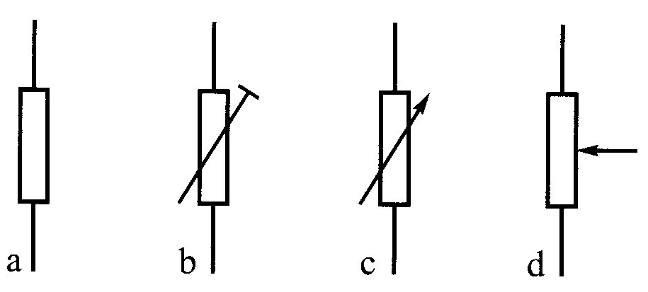

#### Označevanje vrednosti uporov

----

### Magnetno polje trajnega magneta

Potek magnetnega polja okoli magneta **ponazorimo s silnicami**.
To so črte, ki kažejo smer polja in potekajo od severnega proti južnemu polu magneta.

&nbsp;

Če magnet prelomimo, dobimo 2 magneta, ki imata vsak svoj severni in južni pol.

----

### Enosmerni tok in napetost

Enosmerni tok: nosilci naboja tečejo le v eno smer.
**Smer gibanja nosilcev naboja se s časom ne spreminja**

Enosmerna napetost: tista napetost, ki
**generira enosmerni tok in se ji s časom predznak ne spreminja**

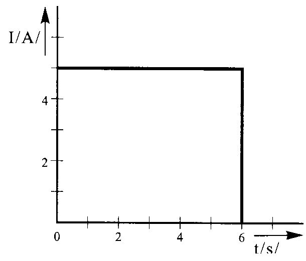

----

### Celice in baterije

Najbolj osnoven izvor enosmerne napetosti

#### Vrste baterij

<table class="compact">
<tr><th></th><th>Svinčene celice</th><th>Ni-Cd</th><th>Ni-Mh</th><th>Li-ion</th><th>Li-ion polimer</th><th>Polnilne alkalne</th></tr>
<tr><td>Nominalna napetost celice</td><td>2v</td><td>1,2v</td><td>1,2V</td><td>3,6V</td><td>3,6V</td><td>1,5V</td></tr>
<tr><td>Število ciklov polnjenja</td><td>500-800</td><td>1500</td><td>500-1000</td><td>1200</td><td>>1000</td><td>50</td></tr>
<tr><td>Lastno praznjenje (%/mesec)</td><td>3-20</td><td>10</td><td>30</td><td>5-10</td><td>5</td><td>zelo nizka</td></tr>
<tr><td>Temp. področje uporabe</td><td>-20 do 60</td><td>-40 do 60</td><td>-20 do 60</td><td>-20 do 60</td><td>0 do 60</td><td>0 do 65</td></tr>
<tr><td>Energija/teža (Wh/kg)</td><td>30-50</td><td>45-80</td><td>60-120</td><td>110-160</td><td>100-200</td><td>80</td></tr>
<tr><td>Obremenitev: max/pripročena</td><td>5C/0,2C</td><td>20C/1C</td><td>5C/0,5C</td><td>>2C/>1C</td><td>>2C/>1C</td><td>0,5C/&lt;0,2</td></tr>
</table>

#### Zaporedna vezava celic

**Skupna napetost enaka vsoti napetosti posameznih baterijskih celic.**

Dopustni tok enak dopustnemu toku ene celice.

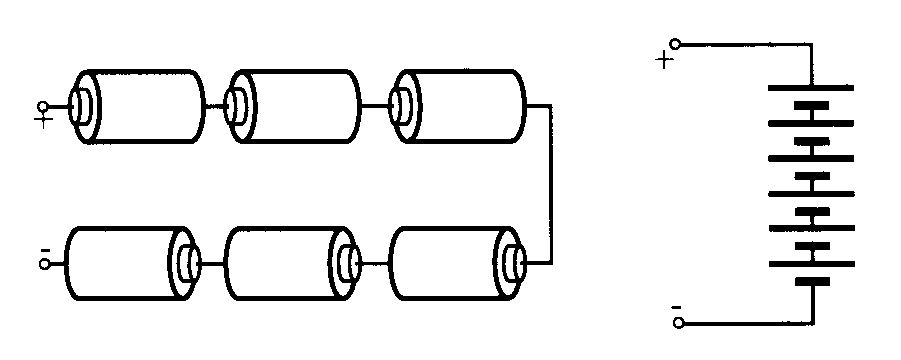

 

#### Vzporedna vezava celic

Skupna napetost enaka napetosti ene celice

**Dopustni tok enak vsoti dopustnih tokov posameznih celic.**

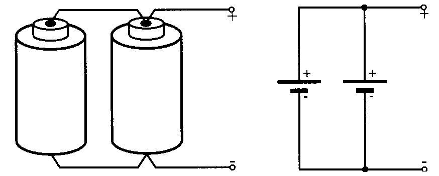

- **Kapaciteta**: koliko časa je celica sposobna dajati določen tok:  
$$ Q = I \sdot t \ [Ah] $$

Primer: Akumulator imam kapaciteto 10 Ah. Koliko časa ga bomo lahko uporabljali, če porabnik troši 500 mA?  
$t = \frac{Q}{I} = \frac{10 Ah}{0.5 A} = 20 h$

- **Notranja upornost** ($R_g$)

- **Kratkostični tok** ($I_k$): **tok, ki steče če pola celice kratko spojimo z vodnikom.**

$$ I_k = \frac{U_c}{R_g} $$

- **Nazivni tok** ($I_n$): "priporočen" / normalni tok uporabe

----

### Električne sheme

Električni krog (baterija in upor)

Shema električnega kroga leve slike

----

### Frekvenca

Število ponavljajočih se dogodkov v časovni enoti

**Frekvenca**: $f\ [Hz]$ _Hertz_

$$ f = \frac{1}{T} = \frac{N}{t} $$

$f$ – frekvenca (Hz)  
$T$ – perioda (s)  
$t$ – čas  opazovanja (s)  
$N$ – število nihajev v času opazovanja

----

### Izmenični tok in napetost

Izmenični tok: **smer gibanja nosilcev naboja se s časom spreminja.**

Izmenična napetost: napetost, ki se s časom spreminja

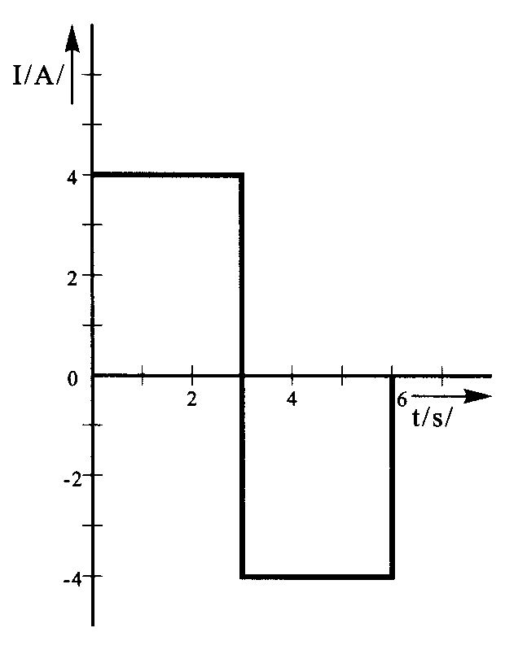

----

### Generator izmenične napetosti

$$ U = U_{max} \sdot \sin(\alpha) $$

----

### Sinusna oblika signala

**Efektivna** vrednost **izmenične napetosti** ($U_\text{ef}$)  je enaka velikosti
enosmerne napetosti, ki povzroči **enak učinek** (efekt) **kot enosmerna napetost** (svetlobni, toplotni,…)

$U_\text{vrh}$ – vrhnja (temenska) vrednost napetosti  
$U_\text{ef}$ – efektivna (RMS – Root Mean Square) napetost  
$U_\text{sre}$ – srednja vrednost napetosti

&nbsp;

Za sinus velja:

$ U_\text{vrh} = \sqrt{2} \sdot U_\text{ef} $

$ U_\text{sre} = \frac{2}{\pi} \sdot U_\text{vrh} $

$ U_\text{vrh} = 1.57 \sdot U_\text{sre} $

**Valovna dolžina** ($\lambda$ – lambda): razdalja, ki jo val prepotuje v času enega nihaja

&nbsp;

**Hitrost** širjenja:  
$v = f \sdot \lambda$  
$v$ – hitrost \[$\frac{m}{s}$]  
$f$ – frekvenca \[Hz]  
$\lambda$ – valovna dolžina \[m]

&nbsp;

**Faza** valovanja: merimo v stopinjah (°).

----

### Sestavljeni signali

#### Primer

Kateri od navedenih signalov je enak vsoti signala A in B?

**Peak envelope voltage** (PEV): vrhnja napetost ovojnice

----

### Ohmov zakon

Nemški znanstvenik Georg Simon Ohm ugotovi, da je **napetost v vezju enaka produktu toka in upornosti**.

$$ U = I \sdot R $$
$$ I = \frac{U}{R} $$
$$ R = \frac{U}{I} $$

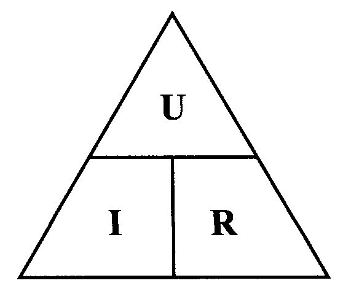

#### Primer 1

$$ R = \frac{U}{I} $$
$$ I = \frac{U}{R} = \frac{12\ V}{25\ \Omega} = 0.48\ A $$

#### Primer 2

$$ R = \frac{U}{I} $$
$$ U = I \sdot R = 6\ \Omega \sdot 3\ A = 18\ V $$

#### Primer 3

$$ R = \frac{U}{I} $$
$$ R = \frac{U}{I} = \frac{6\ V}{0.5\ \Omega} = 12\ \Omega$$

----

### Vezava uporov

#### Zaporedna vezava uporov

$ R_\text{skupna} = R_1 + R_2 + ... $

$ U_\text{skupna} = U_{R1} + U_{R2} + ... $

$ I_\text{skupna} = I_1 = I_2 = ... $

#### Vzporedna vezava uporov

$$ \frac{1}{R_\text{skupna}} = \frac{1}{R_1} + \frac{1}{R_2} + ... $$

$ R_\text{skupna} = \frac{1}{\frac{1}{R_1} + \frac{1}{R_2} + ...} $

$ U_\text{skupna} = U_{R1} = U_{R2} = ... $

$ I_\text{skupna} = I_1 + I_2 + ... $

#### Primer

$ \frac{1}{R_\text{vzp}} = \frac{1}{10} + \frac{1}{10} = \frac{2}{10} = \frac{1}{5} $

$ R_\text{vzp} = 5\ \Omega $

$ R_\text{skupna} = 5\ \Omega + 10\ \Omega = 15\ \Omega $

----

### Realni napetostni vir

$R_g$ – upornost generatorja

$ U_{AB} = U - R_g \sdot I = 6\ V - (4\ \Omega \sdot 0.5\ A) = 4V $

----

### Kirchoffovi zakoni

<a class="center-b" href="https://youtu.be/JbJ6aGYa63k">Razlaga</a>

- **Prvi Kirchoffov zakon** (vsota vseh tokov v vozlišču je enaka nič):

$$\sum I = 0$$

- **Drugi Kirchoffov zakon** (vsota napetosti napetostnih virov v zaprti zanki vezja je enaka vsoti padcev napetosti na vseh delih vezja):

$$\sum U = \sum I \sdot R$$

#### Primer (I. Kirchoffov zakon):

$ \sum I = 0 $

$ I_4 = I_1 + I_2 + I_3 $

$ I_1 = I_4 - I_3 - I_2 = 5A - 5A - 2A = -2A $

#### Primer (II. Kirchoffov zakon):

Zanka 1:  
$ 10\ V = I_2 \sdot 30\ \Omega $

Zanka 2:  
$ 12\ V = I_2 \sdot 30\ \Omega + I_1 \sdot 10\ \Omega $

Zanka 3:  
$ (12\ V - 10\ V) = I_1 \sdot 10\ \Omega $

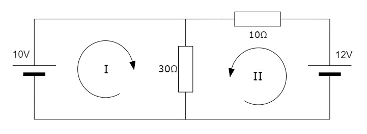

----

### Električna moč

Enosmerne napetosti in tokovi:

$ P = U \sdot I $

$ P= \frac{U^2}{R} $

$ P = I^2 \sdot R $

Izmenične napetosti in tokovi:  
(Ohmska bremena)

$ P_\text{sre} = U_\text{ef} \sdot I_\text{ef} $

$ P_\text{sre} = \dfrac{U^2_\text{ef}}{R} $

$ P_\text{sre} = I^2_\text{ef} \sdot R $

$ P_\text{ef} \neq P_\text{sre} $

**Peak Envelope Power** (PEP): vrhnja (temenska) moč ovojnice, kar pomeni največjo vršno vrednost moči preko določene periode.  
$$ P_\text{PEP} = \frac{U^2_\text{PEV}}{2 \sdot R} $$

----

### Prenos moči

$$ P = I^2 \sdot R \quad \quad I = \frac{U}{R + R_g} $$
$$ P = \frac{U^2 \sdot R}{(R + R_g)^2} $$

**Maksimalni prenos moči** na breme R:  
_"breme prilagodimo generatorju"_

$$ R = R_g \rarr P_{max} = \frac{U^2 \sdot R}{4 \sdot R^2} = \frac{U^2}{4 \sdot R} $$

----

### Električna energija in izkoristek sistema

**Električna energija**: $ W = P \sdot t\ [\text{Ws}] $ _Vatsekunda_

$ 1\ \text{kWh} = 1000\ \text{W} \sdot 3600\ \text{s} = 3600000\ \text{Ws} $

&nbsp;

**Izkoristek** sistema:

$$ \eta = \frac{P_i}{P_v} \quad 0 \le \eta \le 1 $$
$$ \eta = \frac{P_i}{P_v} \sdot 100 \quad 0 \\% \le \eta \le 100 \\% $$

$P_i$ – izhodnja moč (W)  
$P_v$ – vhodna moč (W)

----

### Logaritem

Logaritem je **inverzna funkcija eksponente funkcije**

$$ a^y = x \quad \Leftrightarrow \quad \log_{a} x = y $$

Prebere se: _logaritem števila $x$ z osnovo $a$_

Desetiški logaritem:
$ \log_{10} x = \log x $

Naravni logaritem:
$ \log_{e} x = \ln x $

$$ \log_{a} x = \frac{\log_{y} x}{\log_{y} a} $$

$$ \log_{a} x + \log_{a} y = \log_{a} (xy) $$

$$ \log_{a} x - \log_{a} y = \log_{a} \bigg( \frac{x}{y} \bigg) $$

$$ r \sdot \log_{a} x = \log_{a} x^r $$

----

### Decibel

Decibel je relativna enota, s katero določamo **ojačanje ali slabljenje sistema**.

$$ G(dB) = 10 \sdot \log \bigg( \frac{P_2}{P_1} \bigg) $$

$$ G(dB) = 20 \sdot \log \bigg( \frac{U_2}{U_1} \bigg) = 20 \sdot \log \bigg( \frac{I_2}{I_1} \bigg) $$

<table class="compact center">
<thead>
<tr><th>Ojačanje $G(dB)$</th><th>Razmerje moči $(P_2 / P_1)$</th><th>Razmerje toka ali napetosti $(I_2 / I_1),(U_2 / U_1)$</th></tr>
</thead>
<tbody>
</tbody>
<tr><td>+ 20</td><td>100</td><td>10</td></tr>
<tr><td>+ 10</td><td>10</td><td>3,16</td></tr>
<tr><td>+ 6</td><td>4</td><td>2,00</td></tr>
<tr><td>+ 3</td><td>2</td><td>1,141</td></tr>
<tr><td>0</td><td>1</td><td>1,00</td></tr>
<tr><td>- 3</td><td>0,50</td><td>0,71</td></tr>
<tr><td>- 6</td><td>0,25</td><td>0,50</td></tr>
<tr><td>- 10</td><td>0,10</td><td>0,32</td></tr>
<tr><td>- 20</td><td>0,01</td><td>0,10</td></tr>
</table>

#### Primer

Izračunaj skupno ojačanje sistema:

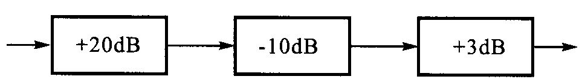

$$ G(dB) = +20\ dB - 10\ dB +3\ dB = + 13\ dB $$

$$ G = 100 \sdot 0.1 \sdot 2 = 20 $$

Dobimo ojačanje +13 dB oz. 20 kratno ojačanje

----

### Induktivnost

Razmerje med magnetnim pretokom skozi sklenjeno zanko in električnim tokom, ki je vzrok tega magnetnega pretoka

- Induktivnost tuljave je 1 H, če se skozi njo spremeni tok za 1 A v času 1 s in pri tem povzroči, da se inducira povratna napetost 1 V.

**Induktivnost**: $L\ [H]$ _Henry_

Pravilo desnega vijaka (smer silnic)

----

### Tuljave

<a class="center-b" href="https://youtu.be/KSylo01n5FY?t=208">Animacija tuljave</a>

Pri idealni tuljavi vedno **tok zaostaja za napetostjo za 90°**

#### Vrste tuljav

Delimo:  
a) stalna tuljava  
b) nastavljiva tuljava  
c) spremenljiva tuljava

Delimo (glede na jedro):  
a) tuljava z železnim jedrom  
b) tuljava z feritnim jedrom

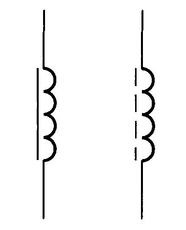

#### Jedro tuljave

**Permeabilnost**: lastnost feromagnetnih materialov jedra, da **poveča induktivnost tuljave**

&nbsp;

**Vrtinčni tokovi**: inducirana napetost žene po železnem jedru tok in ga segreva

**Histerezne izgube**: del elektromagnetne energije, ki se porablja za "magnetno vztrajnost"

----

### Vezava tuljav

Zaporedna vezava
$$ L_\text{skupna} = L_1 + L_1 + ... $$

Vzporedna vezava
$$ \frac{1}{L_\text{skupna}} = \frac{1}{L_1}+\frac{1}{L_{2}}+... $$
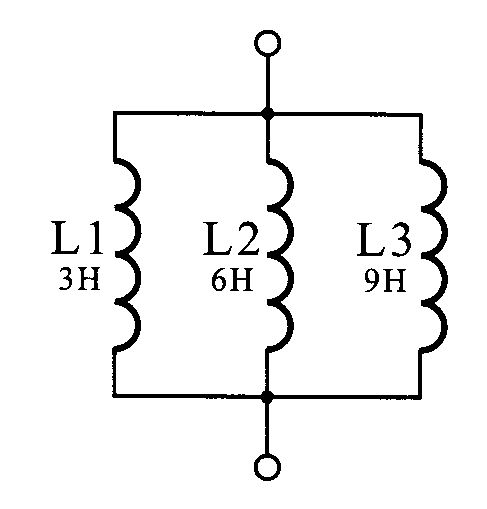

### Realna tuljava

**Induktivna reaktanca** ali induktivna upornost:  
$ X_L = 2 \sdot \pi \sdot f \sdot L$

Kvaliteta tuljave: $ Q = \frac{X_L}{R_L} $

&nbsp;

**Skin efekt** (kožni pojav): s frekvenco se povečuje upornost žice.

Pri višjih frekvencah tok raje teče po površini žice, kot po njej.

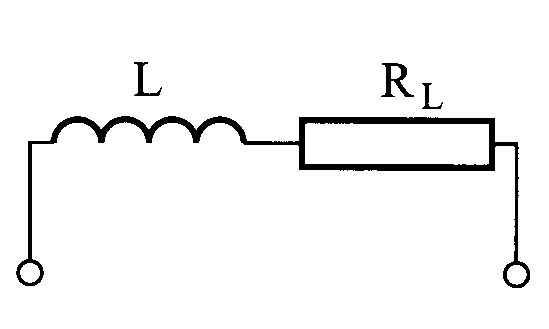

----

### Transformator

**Medsebojna induktivnost**: magnetno polje ene tuljave povzroči inducirano napetost v drugi tuljavi

**Sklopni faktor** dveh tuljav je število, ki
pove, kolikšen del magnetnega pretoka ene
tuljave se sklene tudi skozi ovoje druge
tuljave.  
Teoretično možne vrednosti sklopnih
faktorjev so med 0 in 1.

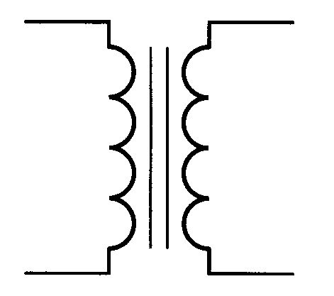

**Izkoristek** transformatorja:

$$ P_s = \eta \sdot P_p $$

$P_p$ – moč na primarju (W)  
$P_s$ – moč na sekundarju (W)  
$\eta$ – izkoristek transformatorja

**Razmerja napetosti, toka in števila navojev**:

$$ \frac{U_p}{U_s} = \frac{n_p}{n_s} = \frac{I_s}{I_p} $$

$U_p$ – napetost primarja (V)  
$U_s$ – napetost sekundarja (V)  
$I_p$ – tok primarja (A)  
$I_s$ – tok sekundarja (A)  
$n_p$ – število ovojev primarja  
$n_s$ – število ovojev sekundarja

#### Primer

Izračunaj napetost in tok na sekundarju transformatorja, če je na primarju napetost 220 V in tok 2 A. Število ovojev na primarju je 1000, na sekundarju pa 100.

$$ \frac{U_p}{U_s} = \frac{n_p}{n_s} = \frac{I_s}{I_p} = \frac{1000}{100} $$

$$ U_s = \frac{U_p}{10} = \frac{220\ V}{10} = 22\ V $$

$$ I_s = I_p \sdot 10 = 2\ A \sdot 10 = 20\ A $$

----

### Vezave transformatorjev in uporaba

Zaporedna vezava navitij

Kaskadna vezava

**Uporaba** transformatorjev:
- izoliranje enega dela vezja od drugega (galvanska ločitev)
- dviganje ali nižanje napetosti (napajalniki)
- **impedančna transformacija oz. prilagoditev**

----

### Kapacitivnost

Zmožnost **shranjevanja električne energije** v obliki **električnega naboja**, ki ustvari **električno polje**

**Kapacitivnost**: $C\ [F]$ _Farad_

----

### Kondenzatorji

<a class="center-b" href="https://youtu.be/X4EUwTwZ110?t=94">Razlaga kondenzatorja</a>

a) stalni kondenzator  
b) nastavljivi kondenzator  
c) spremenljivi kondenzator  
d) elektrolitski kondenzator

Pri idealnem kondenzatorju **tok fazno prehiteva napetost za 90°**

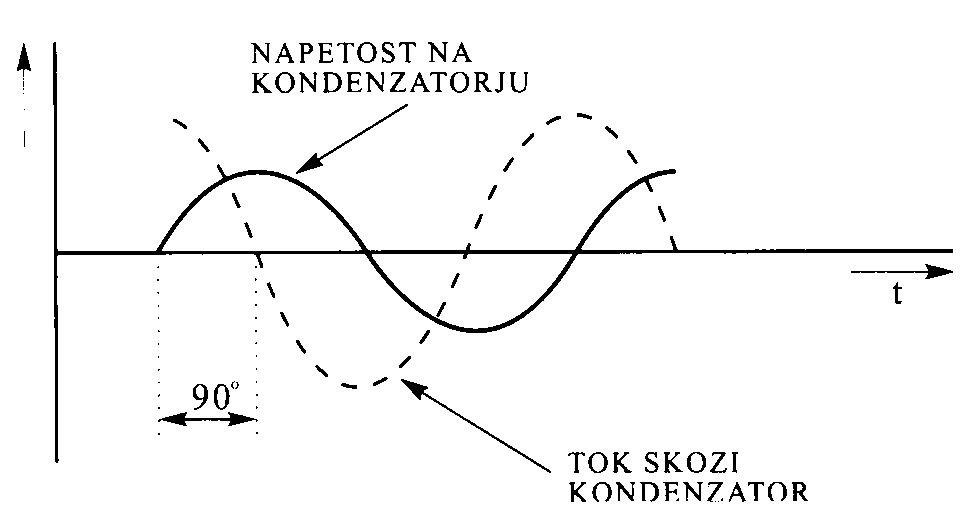

### Realni kondenzatorji

**Kapacitivna reaktanca**: $ X_C = \dfrac{1}{2 \sdot \pi \sdot f \sdot C} $

**Izgubni** (prečni) **tok** kondenzatorja: tok, ki teče skozi kondenzator
zaradi neidealnega dielektrika.

**Temperaturna odvisnost** kondenzatorja: vzrok je sprememba dielektrika,
saj se mu spreminja dielektrična konstanta.

----

### Vezave kondenzatorjev

Vzporedna vezava
$$ C_\text{skupna} = C_1 + C_2 + ... $$
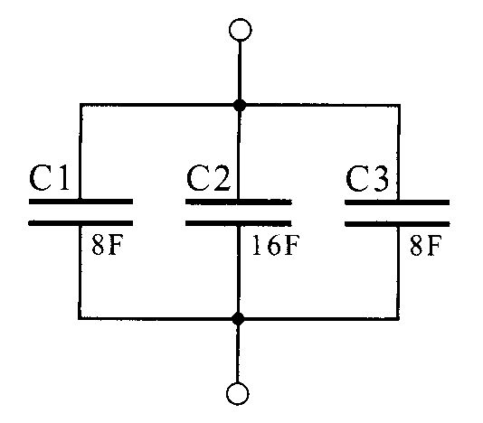

Zaporedna vezava
$$ \frac{1}{C_\text{skupna}} = \frac{1}{C_1} + \frac{1}{C_2} + ... $$

----

### Reaktanca

V praktičnih vezjih se pojavijo kombinacije obeh:

Induktivna reaktanca:
$ X_L = 2 \sdot \pi \sdot f \sdot L$

Kapacitivna reaktanca:
$ X_C = \frac{1}{2 \sdot \pi \sdot f \sdot C} $

Zato raje govorimo o **reaktanci**, ki ima lahko **induktivni** ali **kapacitivni značaj**

**Reaktanca**: $X\ [\Omega]$ _ohm_

Vrednost reaktance se **spreminja glede na frekvenco**

**Reaktančna bremena ne trošijo električne energije** (jalova moč)

Velja ohmov zakon: $ U = X \sdot I $

### Impedanca

Vsa praktična vezja vsebujejo reaktanče in ohmske upornosti

**Impedanca**: $ Z = R + iX\ [\Omega]$ _ohm_

&nbsp;

$Z = R + jX_L$  
&rarr; impedanca upornosti R in reaktance induktivnega značaja

$Z = R - jX_C$  
&rarr; impedanca upornosti R in reaktance kapacitivnega značaja

Velja ohmov zakon: $ U = Z \sdot I $ (bolj kompleksno zaradi imaginarne komponente)

### Resonanca

Obstaja frekvenca kjer se **vrednost kapacitivne reaktance izenači induktivni reaktanci** &rarr; se izničita

$ X_C = X_L $

$ \frac{1}{2 \sdot \pi \sdot f \sdot C} = 2 \sdot \pi \sdot f \sdot L $

$$ f = \frac{1}{2 \sdot \pi \sdot \sqrt{L \sdot C}} $$

Te frekvenci pravimo **resonančna frekvenca**, pojavu pa **resonanca**

Impedanca pri resonančni frekvenci: $ Z = R \pm j0 = R $

----

🚧 Under construction 🚧

----

### Filtri

Vezja, ki prepuščajo izmenične tokove določenih frekvenc, medtem ko tokove drugih frekvenc zelo oslabijo ali pa jih sploh ne prepuščajo

Sestavljeni iz pasivnih elementov (kondenzatorjev, tuljav in uporov)

**Tuljava dobro prepušča nizke frekvence, kondenzator pa visoke**

----

### Zaporedni in vzporedni nihajni krog

Zaporedni nihanji krog  
v resonanci prepušča tok.

Vzporedni nihanji krog  
v resonanci ne prepušča toka.

#### Zaporedni nihajni krog

**Resonančna frekvenca**:
$ f_{RES} = \dfrac{1}{2 \pi \sqrt{LC}} $

**Kvaliteta** nihajnega kroga:
$ Q = \dfrac{X_L}{R} $ ali $ Q = \dfrac{X_C}{R} $

**Pasovna širina** (bandwidth): $ B = f_2 - f_1 $  
$f_1$ in $f_2$ odčitamo kjer je vrednost toka $ \frac{1}{\sqrt{2}} = 0.71 $ oz. $ -3dB $

$ Q = \frac{f_{RES}}{B} $

**Napetost na tuljavi in kondenzatorju** v zaporednem nihajnem krogu sta pri resonančni frekvenci **Q-krat večji od napetosti izvora** ampak fazno **zamaknjeni za 180°**

#### Vzporedni nihajni krog

Enačbe za resonančno frekvenco, kvaliteto in pasovno širino so enake kot pri zaporednem nihajnem krogu

&nbsp;

**Velikost toka skozi vezje** je pri resonančni frekvenci majhna, v **tuljavi in kondenzatorju** pa je lahko **tok Q-krat večji**

----

### Vrste filtrov

Filtre delimo po različnih merilih, npr. frekvenčni pas:
- **Nizko-prepustni** filter
- **Visoko-prepustni** filter
- **Pasovno-prepustni** filter
- **Pasovno-zaporni** filter

**Amplitudni frekvenčni odziv**: pove katere frekvence filter prepušča
in katere slabi.

**Prenosna funkcija**: pove vpliv filtra na amplitudo in fazo vhodnega
signala.

Vsak filter povzroči **fazni zamik**

### $T$ in $\Pi$ (Pi) filtri

**Red filtra**: število elementov v vezju

Višji kot je red filtra, bolj se amplitudni odziv približuje idealnemu

**Resonatorji**: zelo ozka pasovno-prepustni ali pasovnozaporni filtri z zelo veliko kvaliteto Q.

##### Pasovnoprepustni kristalni filter

**Overtonska frekvenca**: nihanje ploščice kremenovega kristala na mnogokratniku osnovne frekvence kristala.

**Overtonski oscilator**: kristal lahko niha le na overtonskih frekvencah, ki so lihi mnogokratniki osnovne frekvence.

----

### Polprevodniki

Čisti polprevodnik, silicij ali germanij.
Oba imata štiri elektrone na zunanji obli atoma, ki so med seboj vezani s kovalentno vezjo. Vsak od atomov prispeva elektron iz zunanje oble za dobro soseščino z drugim atomom.
Atom ima 4 sosede, zato mora prispevati 4 elektrone z zunanje oble.
Izgleda, kot da okrog atoma kroži osem elektronov.
Zaradi zapolnjene valenčne oble ima tak prevodnik lastnosti izolanta.
Zato čistemu polprevodniku dodamo primesi.
[]Elektronski elementi in vezja, Lorencon Robert

Dopiranje: najpomembnejši postopek pri izdelavi polprevodnikov, ki predstavlja dodajanje primesi polprevodniku.

**N tip polprevodnika:**
Donorji: petvalentne primesi, kot so fosfor, arzen, antimon, ki povečajo v polprevodniku število prostih elektronov.

**P tip polprevodnika:**  
Akceptorji: trivalentne primesi, kot so, bor,
aluminij, galij, indij, ki ustvarijo gibljive vrzeli.

#### PN spoj:
1. Elektroni in vrzeli prehajajo iz enega v drugi tip polprevodnika in povzročijo difuzijski tok.
2. Na stični površini prihaja do rekombinacij.
3. Zaradi rekombinacij se poruši električna nevtralnost polprevodnika in nastane električno polje.
4. Električno polje ustavi rekombinacijo, ustvari se zaporna napetost.

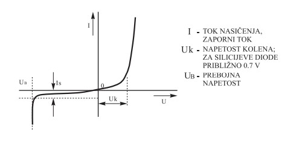

Dioda v zaporni smeri prevaja majhen tok, ki ga imenujemo **zaporni tok ali tok nasičenja.**

svetleča dioda (LED)

Varicap dioda

Tunelska dioda

Zener dioda

Zener diodo priključimo v vezju zaporno.

----

### Tranzistor (bipolarni)

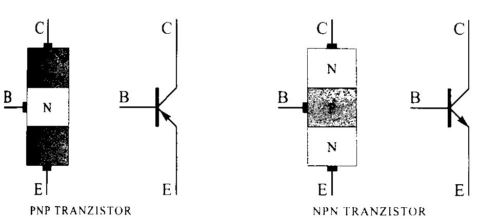

Priključki: baza, kolektor, emitor

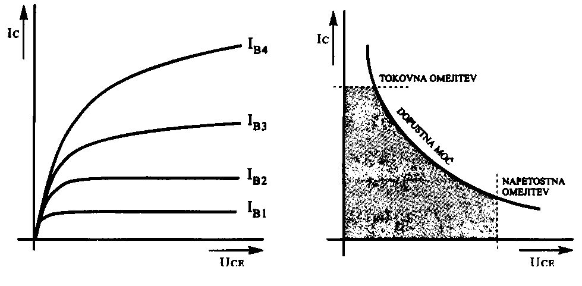

Možne orientacije tranzistorja

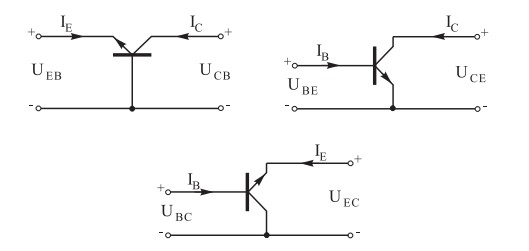

$I_C/U_{CE}$ in močnostna karakteristika tranzistorja

**Tokovno ojačanje tranzistorja s skupnim emitorjem:**  
$ \alpha = \frac{I_C}{I_B} $

----

### Delovna točka in uporaba tranzistorja

----

### NF in VF ojačevalnik

Načelna shema NF ojačevalnika

Načelna shema VF ojačevalnika

Preveliko **segrevanje** lahko privede do uničenja ojačevalnika, zato je potrebno
poskrbeti za **primerno hlajenje**.

----

### Tranzistor (unipolarni)

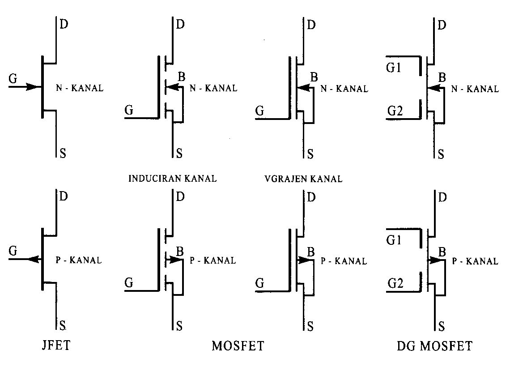

Priključki tranzistorja:
- drain (ponor)
- gate (**krmilna elektroda**)
- source (izvor)

Unipolarni tranzistor (FET):
- unipolarni tranzistor s PN spojem ali spojni FET (JFET)
- unipolarni tranzistor z izolirano krmilno elektrodo (IGFET, MOS FET)

V unipolarnem tranzistorju električni tok prenašajo večinski naboji v kanalu. Od tod tudi
izhaja ime unipolarni tranzistor za razliko od bipolarnega tranzistorja, v katerem prispevajo
tokovom vseh elektrod oboji nosilci nabojev (elektroni in vrzeli).

----

### Digitalna integrirana vezja
Digitalna integrirana vezja poznajo le dve logični stanji.

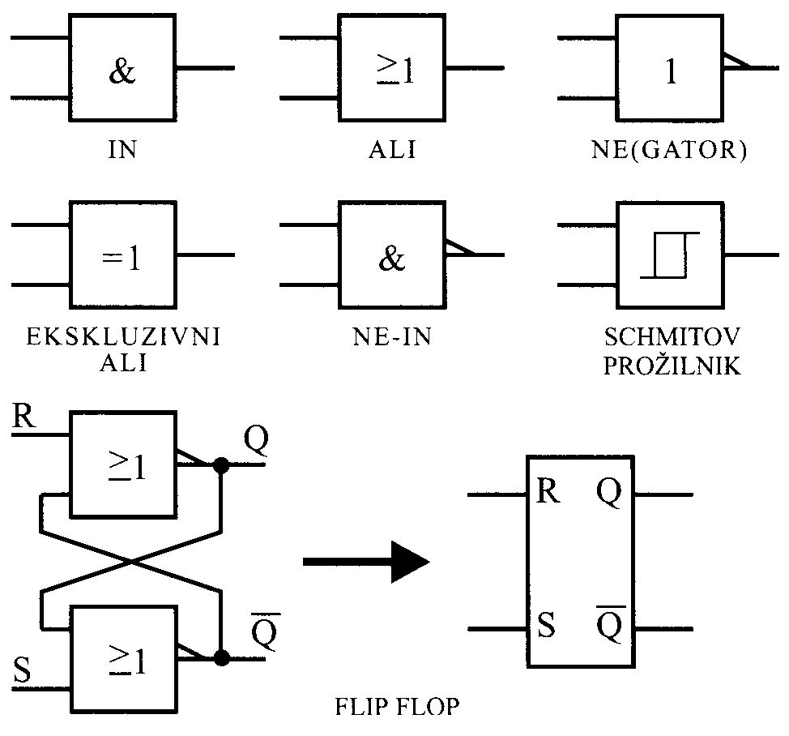
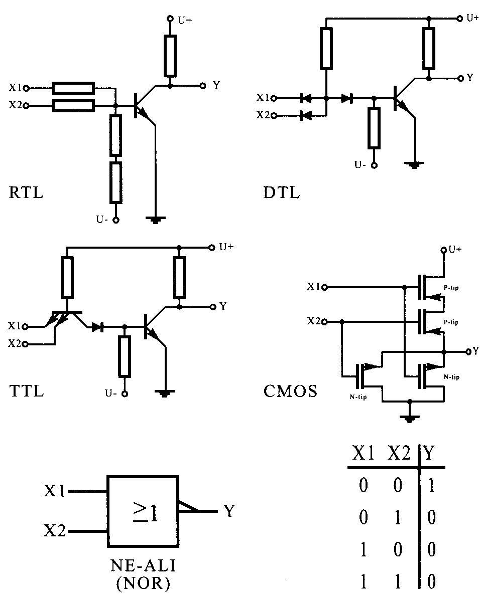
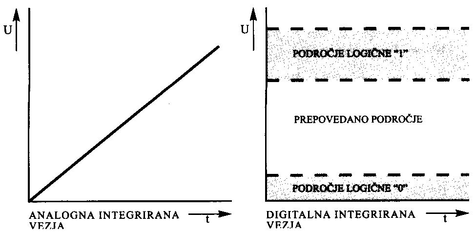

Vrata NE-ALI (NOR)

----

### Analogna integrirana vezja
Pri analognih integriranih vezjih **izhodni signal zvezno sledi spremembi vhodnega signala.**
 
Operacijski ojačevalnik

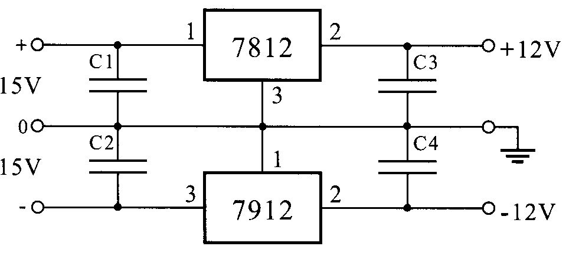
Stabilizirani napajalnik za simetrično napetost

----

### Razred delovanja ojačevalnikov

Nastavitev delovne točke določa **kvaliteto ojačevalnika, predvsem glede linearnosti, pa tudi glede ojačanja toka $A_I$, napetosti $A_U$ in izkoristka $\eta.$**

Glede na postavitev delovne
točke ločimo:
- a - Razred A
- b - Razred B
- c - Razred AB
- d - Razred C

----

### Razred A

Delovna točka: se nahaja v linearnem delu $I_C/U_{BE}$ karakteristike, zato teče skozi tranzistor enosmerni kolektorski tok, ne glede na prisotnost vhodnega signala.

- Izkoristek:  zelo majhen (30%), majhna izhodna moč.
- Linearnost: popačenje najmanjše, linearnost največja.
- Uporaba: v VF tehniki za SSB ojačevalce, QPSK, QAM…

----

### Razred B

Delovna točka: se nahaja v spodnjem delu $I_C/U_{BE}$ karakteristike običajno v točki, kjer preneha tečikolektorski tok, ko ni na vhodu signala.

- Izkoristek: dosti večji kot v razredu A (65%), prav tako
izhodna moč.
- Linearnost: popačenje velika.
- Uporaba: v ojačevalnikih moči.

----

### Razred AB

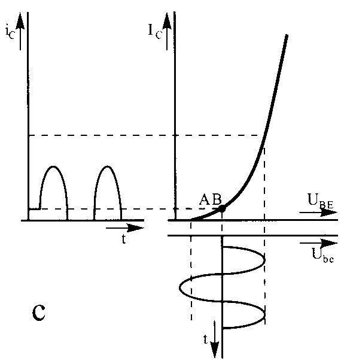

Delovna točka: zaradi zakrivljenosti karakteristike IC/UBE v njenem spodnjem delu, se popačenju ne moremoizogniti, zato v AB razredu delovno točko postavimo v vmesni položaj.

- Izkoristek: izkoristek manjši kot v razredu B (50-60%),
skoz teče manjši kolektorski tok.
- Linearnost: večja kot v B, saj se popačenje drastično
zmanjša.
- Uporaba: ojačevanje napetosti in tudi moči.

----

### Razred C

Delovna točka: se nahaja v zapornem področju
tranzistorja.

- Izkoristek: tok skozi tranzistor teče samo v
vrhovih period vhodnega signala (80%).
- Linearnost: zelo slaba, popačenja največja.
- Uporaba: primeren za ojačevanje konstantnih signalov,
predvsem v VF tehniki, v NF vezjih ni uporaben (FM, CW).

----

### Elektronske cevi (elektrode)
Kljub silnemu napredku tehnologije na področju tranzistorjev elektronske cevi še niso izgubile popolne veljave v **končnih stopnjah močnostnih ojačevalnikov.**

Glede na število priključkov ločimo elektronske cevi na:
- dioda (2)
- trioda (3)
- tetroda (4)
- pentoda (5)
- heksoda (6)
- …

----

### Napajalnik - usmernik

Polvalno in polnovalno usmerjanje

Vezji za stabilizacijo napetosti

Gladilnik napetosti

Glajena in stabilizirana napetost

----

### Izvedba napajalnika

----

### Mikrofoni
Mikrofon je naprava, ki zvočna nihanja pretvori v električno napetost.
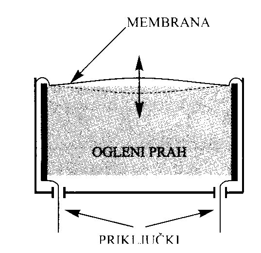
Ogleni mikrofon

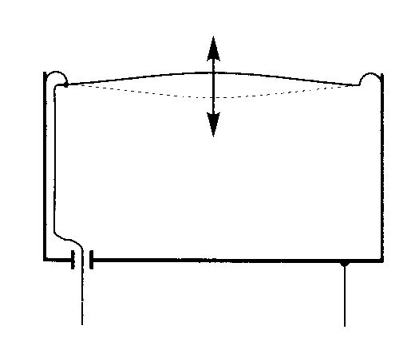
Kondenzatorski mikrofon

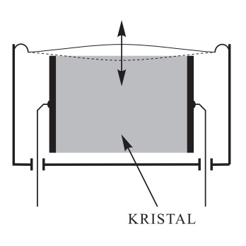
Kristalni mikrofon

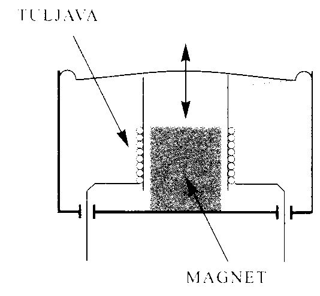
Dinamični mikrofon

----

### Zvočnik
Zvočnik je naprava, ki električno napetost pretvarja v mehansko nihanje membrane.
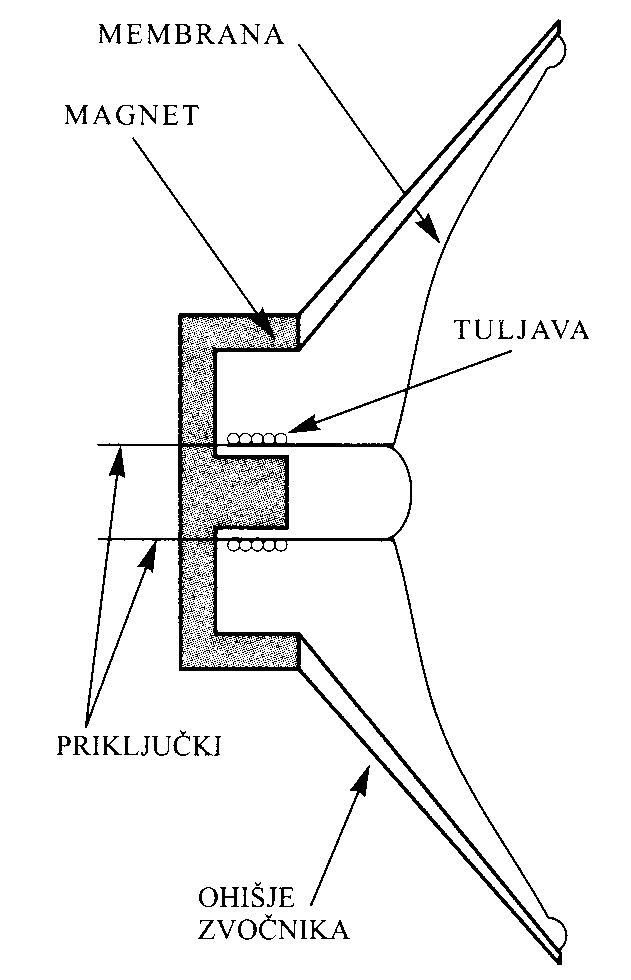

----

### Vzorčenje

Pretvorba analognega signala v digitalnega z **A/D** pretvornikom imenujemo **vzorčenje**

**Minimalna vzorčevalna frekvenca** pri digitalni obdelavi signalov je enaka **dvakratniku najvišje frekvence vzorčenega signala**
- **Nyquistova frekvenca**

**Kvantiziranje**: vrednosti vzorca priredimo najbližje možne diskretne vrednosti

**Kvantizacijski nivo** $= 2^n$, kjer je $n$ število bitov

**Kvantizacijski šum ali napaka**: negotovost ko na podlagi diskretne vrednost signala ni mogoče zagotovo sklepati na pravo vrednost prvotnega signala

**Aliasing** (popačeno zaznavanje): spektralno prekrivanje pri vzorčenju analognega signala

**Anti-aliasing filter** (protiprekrivni filter): omeji pasovno širino vhodnega signala pred digitalno obdelavo

----

### Digitalno procesiranje signalov

**Konvolucija**: rezultat matematične **kombinacije dveh signalov**, kjer dobimo kot rezultat tretji signal. Izredno pomembna operacija pri DSP.

Konvolucija: $y[n] = x[n] * h[n]$

Konvolucijska vrsta: $y[i] = \sum _{j=0}^{M-1} h[j] \sdot [i-j]$

**Fourierjeva transformacija** - pretvorba signala iz časovnega prostora v frekvenčni prostor

**Diskretna Fourierova transformacija** (**DFT**) - z digitalnimi signali

**Hitra Fourierova transformacija** (**FFT**) - učinkovitejša in hitrejša metoda za izračun DFT

Digitalni filtri:
- **FIR** - filter s končnim impulznim odzivom
- **IIR** - filter z neskončnim impulznim odzivom