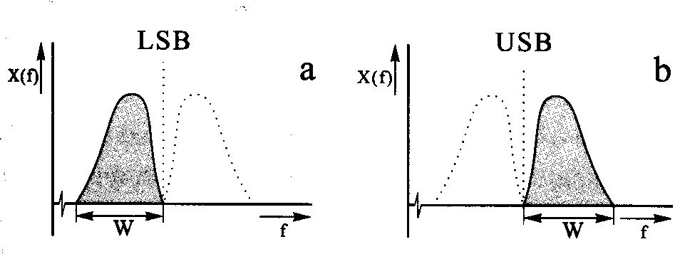
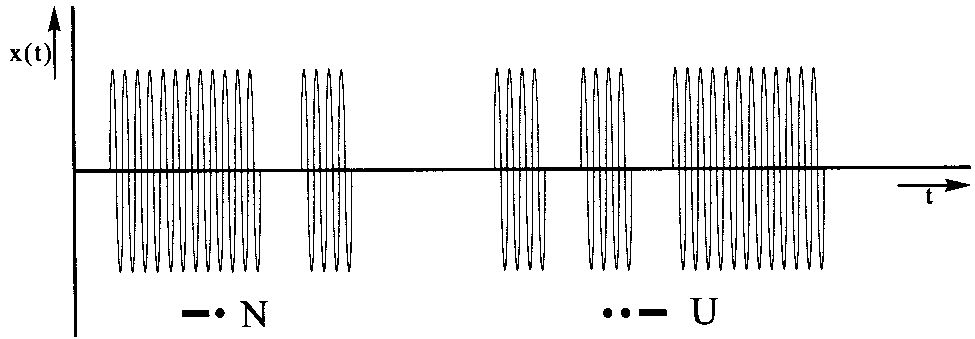
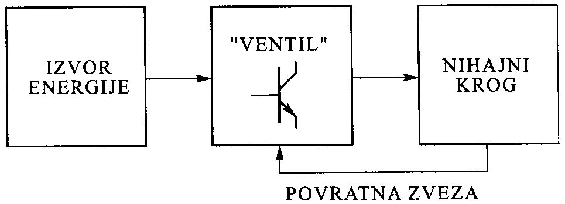
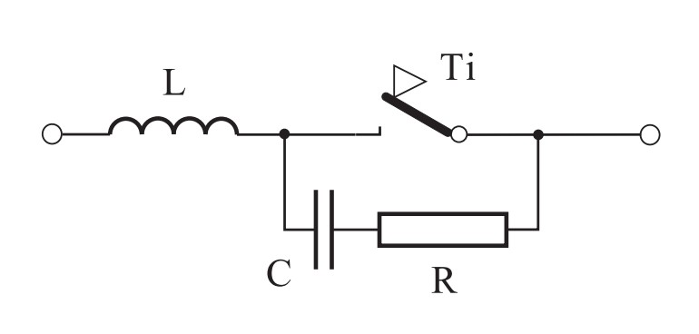
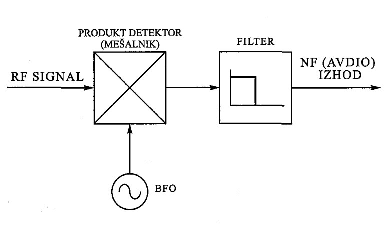
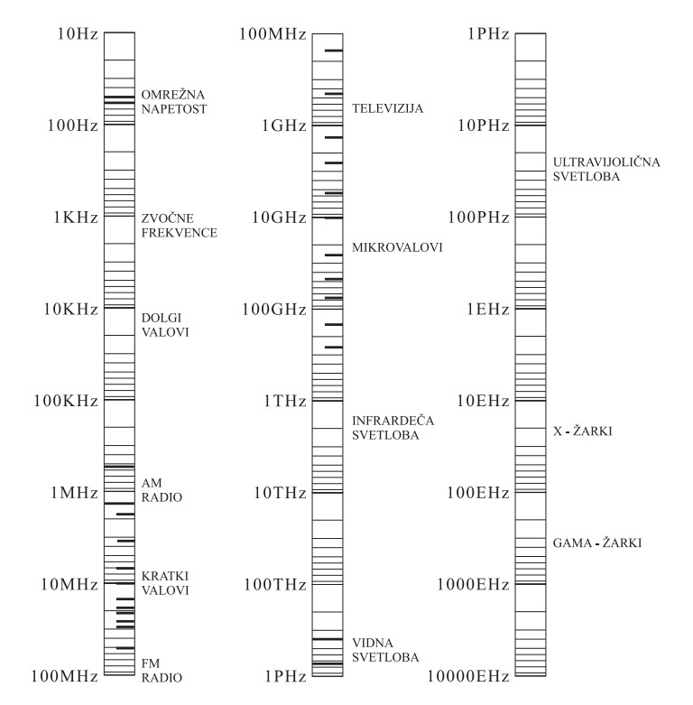

## 6. Radiotehnika

----

### Signali

**Signali so nosilci informacij**

**Nosilni val** / Nosilni signal / Nosilec: Radijski val določene frekvence, ki “nosi” informacijo

**Modulacija**: postopek, s katerim nosilni val **opremimo z informacijo**

**Sinusni signal**:
- primeren za uporabo, ker se **pri prehodu skozi linearno električno vezje njegova oblika ne spremeni**
- Spremeni se mu lahko **le amplituda in faza**

VSAK signal lahko obravnavamo kot **vsoto sinusnih signalov različnih amplitud in frekvenc**

**Frekvenčni spekter**: podaja informacijo o zastopanih frekvencah signala, amplitudi

Frekvence sinusnih signalov, ki so večkratniki osnovne frekvence imenujemo **višje harmonske komponente** (harmoniki)

Fazni zasuk: **vsak filter povzroči fazni zasuk**!

**Filtriranje signala**: izločitev določenih frekvenčnih komponent

Če želimo signalom spremeniti amplitudo jih ojačimo ali oslabimo.
- **Ojačevalnik**: naprava, ki signale ojačuje (poveča amplitudo)
- **Slabilnik** (**atenuator**): naprava, ki signale slabi (zniža amplitudo)

----

### Vzorčenje signalov

Pretvorba analognega signala v digitalnega z **A/D** pretvornikom imenujemo **vzorčenje**

**Minimalna vzorčevalna frekvenca** pri digitalni obdelavi signalov je enaka **dvakratniku najvišje frekvence vzorčenega signala**
- **Nyquistova frekvenca**

**Kvantiziranje**: vrednosti vzorca priredimo najbližje možne diskretne vrednosti

**Kvantizacijski nivo**
- Število kvantizacijskih nivojev $= 2^n$, $n$ je število bitov

**Kvantizacijski šum ali napaka**: negotovost ko na podlagi diskretne vrednost signala ni mogoče zagotovo sklepati na pravo vrednost prvotnega signala

**Aliasing** (popačeno zaznavanje): spektralno prekrivanje pri vzorčenju analognega signala

**Anti-aliasing filter** (protiprekrivni filter): omeji pasovno širino vhodnega signala pred digitalno obdelavo

----

### Digitalno procesiranje signalov

**Konvolucija**: rezultat matematične **kombinacije dveh signalov**, kjer dobimo kot rezultat tretji signal. Izredno pomembna operacija pri DSP.

Konvolucija: $y[n] = x[n] * h[n]$

Konvolucijska vrsta: $y[i] = \sum _{j=0}^{M-1} h[j] \sdot [i-j]$

**Fourierjeva transformacija** - pretvorba signala iz časovnega prostora v frekvenčni prostor

**Diskretna Fourierova transformacija** (**DFT**) - z digitalnimi signali

**Hitra Fourierova transformacija** (**FFT**) - učinkovitejša in hitrejša metoda za izračun DFT

Digitalni filtri:
- **FIR** - filter s končnim impulznim odzivom
- **IIR** - filter z neskončnim impulznim odzivom

----

### Množenje frekvenc

Lastnost ojačevalnikov, da popačijo signal (signal vsebuje višje harmonske
komponente) nam pride prav pri tako imenovanem **množenju frekvenc**

**Množilna stopnja**: realni ojačevalnik v C razredu

----

### Mešanje signalov

V mešalnik pripeljemo signal $f_1$ in $f_2$,
na izhodu mešalnika dobimo:
- $f_1 + f_2$ (mešanje navzgor)
- $f_1 - f_2$ (mešanje navzdol)

#### Primer

Če mešamo $f_1 =$ 576 MHz in $f_2 =$ 144 MHz dobimo na izhodu:
- $f_1 + f_2 =$ 720 MHz
- $f_1 - f_2 =$ 432 MHz

Če želimo samo 432 MHz ali 720 MHz, dodamo filter.

----

### Modulacija

Nosilec **moduliramo z informacijskim signalom**, postopek imenujemo **modulacija**.

Obratni postopek, ki **izlušči informacijo na sprejemni strani iz nosilca** imenujemo **demodulacija**.

$$ u(t) = A \cdot \cos(2 \pi f t + \varphi) $$

Za prenos informacije spreminjamo enega od parametrov:
- amplitudo &rarr; **Amplitudna** modulacija (**AM**, A3E)
- frekvenco &rarr; **Frekvenčna** modulacija (**FM**, F3E)
- fazo &rarr; **Fazna** modulacija (**PM**, G3E)

----

### Pasovna širina

Če se signal s časom **hitro spreminja**, potem ima **širok frekvenčni spekter** oz. zahteva veliko **pasovno širino**!

Pasovna širina in frekvenca nosilca sta tesno povezani:
Večja kot je pasovna širina, višja mora biti frekvenca nosilca

Pasovna širina realnega vzporednega nihajnega kroga, ki ima Q faktor od 10 do 100, se giblje od 1 do 10% okrog resonančne frekvence.

$$ 0.01 < \frac{B}{f_c} < 0.1 $$

$B$ – pasovna širina  
$f_c$ – frekvenca nosilca

Zgornja meja zmogljivosti komunikacijskega sistema:

$ C = B \sdot \log \bigg(1 + \dfrac{S}{N} \bigg) $

$C$ – kapaciteta kanala  
$B$ – pasovna širina  
$\frac{S}{N}$ – razmerje signal/šum

----

### Amplitudna modulacija – AM

Spreminjamo **amplitudo nosilca**

Pasovna širina AM signala:  
$ B = 2 \sdot W $  
$W$ – pasovna širina modulacijskega signala

----

### Double-SideBand – DSB

Izkaže se, da pri AM modulaciji najmanj 50% moči porabimo za nosilec, ki sploh ne nosi nobene informacije.

Nosilec potlačimo DSB-SC (Double-SideBand Supressed-Carrier) ali krajše **DSB**.

----

### Single-SideBand – SSB

Da privarčujemo še na pasovni širini signala odstranimo še enega od bočnih pasov, saj na obeh prenašamo enako informacijo in dobimo enobočno modulacijo, ki jo označimo s **SSB** (single-sideband).
- **LSB** – spodnji bočni pas (lower sideband)
- **USB** – zgornji bočni pas (upper sideband)

----

### Frekvenčna modulacija – FM

Spreminjamo **frekvenco nosilca**

Pasovna širina FM signala:  
$ B = 2 \sdot W + 2 \sdot D $  
$W$ – max frekvenca modulacijskega signala  
$D$ – frekvenčna deviacija

**Frekvenčna deviacija** je definirana kot **največji odmik frekvence FM signala od nosilne frekvence** in je sorazmerna amplitudi modulacijskega signala.

----

### Fazna modulacija – PH

Spreminjamo **fazo nosilca**

Ker spreminjamo fazo, spreminjamo tudi frekvenco, zato se tudi pri fazni modulaciji **pojavi frekvenčna deviacija**

 

Ogled animacije je možen na: <a>https://en.wikipedia.org/wiki/Phase_modulation</a>

----

### Telegrafija (CW)

**Continuous wave**

Najpreprostejši način moduliranja nosilnega vala.  
**Nosilec** preprosto **vklapljamo in izklapljamo** v ritmu vnaprej dogovorjenih znakov (Morse-kod).

Ima **najmanjšo pasovno širino** (100 Hz), oddajamo/sprejemamo samo eno frekvenco.

----

🚧 Under construction 🚧

----

### Radijski oddajnik

**Radijski oddajnik**: naprava, ki ustvari radiofrekvenčni signal, ga opremi z informacijo, ojača in nato pošlje v anteno, kjer se izseva v prostor

Elektronski sklopi, ki proizvajajo radiofrekvenčne (RF) signale:
- električni oscilatorji
- RF sintezatorji

----

### Oscilatorji

Električni **oscilator**: **izvor izmeničnih tokov** ali napetosti **določene frekvence**

Oscilator na področju radijskih frekvenc &rarr; RF oscilator

Prva stopnja oddajnika, določa frekvenco na kateri bo oddajnik deloval

Če nihajnemu krogu dovedemo začetno energijo, ta zaniha (dušeno).

Želimo nedušeno nihanje &rarr; oscilator

#### Osnovni elementi oscilatorja

- **Izvor energije**
    - enosmerne napetosti
- **Nihajni krog**
    - določa frekvenco
- **"Ventil"** (tranzistor ali elektronka)
    - dovajanje energije nihajnemu krogu
- **Povratna zveza**

#### Realni oscilatorji

**Amplitudni šum**: nezaželeno spreminjanje amplitude

**Fazni šum**: nezaželeno spreminjanje faze

Dobremu oscilatorju se frekvenca čimmanj spreminja (je **stabilen**),
nanj vplijo:
- mehanska in električna izvedba
- starost
- temperaturne spremembe

#### Vrste oscilatorjev

- **Kristalni** oscilatorji (**XO**)
- **Kristalni** oscilatorji **spremenljive frekvence** (**VXO**)
    - kristalu zaporedno/vzporedno vežemo spremenljiv kondenzator ali zaporedno tuljavo
- Oscilator **spremenljive frekvence** (**VFO** – Variable Frequency Oscillator)
    - LC nihajni krog, zaporedno vežemo spremenljiv kondenzator
- **Napetostno kontroliran** oscilator (**VCO** – Voltage Controlled Oscillator)
    - LC nihajni krog z varaktorsko (varicap) diodo

#### Heterodinski oscilator

"Heterodyning" – kombiniranje ali mešanje dveh signalov

Zgornja meja VFO-ja z dobro stabilnostjo: 7-10 MHz

&nbsp;

Pri višjih frekvencah se uporablja **heterodinski oscilator** (Heterodyne oscillator)

Signal iz **VFO**-ja **mešamo s** signalom **XO** (kristalnega oscilatorja)
in nato **s filtrom izločimo signal želene frekvence**

----

### RF sintetizatorji

Danes vlogo VFO prevzeli frekvenčni sintetizatorji:
- PLL sintetizator
- DDS sintetizator
- Kombinacija obeh

### PLL sintetizator

**PLL** – Phase-Locked Loop

Uporabimo **VCO**, ki ga **s pomočjo povratne zanke stabiliziramo** (fazno sklenjena zanka)

Frekvenco **nastavljamo digitalno s programiranjem programirnega delitelja**

Referenčna frekvenca ($f_\text{REF}$) določa najmanjši frekvenčni korak

#### Primer PLL sintetizatorja

Imamo PLL sintetizator. Zanka se je že ujela. Referenčna frekvenca je 100 kHz, programirni delitelj pa je nastavljen tako, da deli s 128. Kolikšna je izhodna frekvenca?

$$ f_\text{IZH} = N \sdot f_\text{REF} $$

$$ f_\text{IZH} = 128 \sdot 100\ \mathrm{kHz} = 12800\ \mathrm{kHz} = 12.8\ \mathrm{MHz} $$

### Direktni digitalni sintetizator – DDS

Vrednosti sinusa vnaprej izračunamo in jih shranimo (v "glej tabeli")

Ko preberemo iz tabele, pretvorimo v analogni signal in ga filtriramo

Frekvenco določa generator urnih impulzov (clock)

----

### Zgradba oddajnika

- **Oscilator**
- **Ločilna stopnja** (Buffer)
    - prepreči vpliv naslednje stopnje na oscilator
- **Krmilna stopnja** (Driver)
    - ojača signal na moč pri kateri bo delovala končna stopnja
- **Končna stopnja** (PA – Power Amplifier)
    - ojača signal in filtrira višje harmonike
    - izkoristek: 40-70%

Vse stopnje morajo biti impedančno prilagojene &rarr; za največji prenos moči

----

### CW oddajniki

Oječevalnik razreda C

#### "Klik" in "Anti-klik" filter

----

### SSB oddajniki

**Balansni modulator**, vhodni modulacijski signal in nosilni val &rarr; DSB signal

DSB signal s SSB filtrom (kristalni, 1.8 – 3 kHz) pretvorimo v USB ali LSB signal

Oječevalnik razreda A ali AB

#### Ovojnica SSB signala

Želimo da je razlika med vrhnjo in povprečno vrednostjo amplitude čim manjša

- Audio **clipper**: **poreže vrhove** zvočnega signala
- Audio **compressor**: **drži** zvočni **signal v določenem območju**
    - ojačevalnik s povratno vezavo
- Obstajata tudi RF clipper in RF compressor oz. **ALC** (Automatic Level Control)

----

### FM oddajniki

- Kvaliteten prenos govora
- Ne uporablja na KV (velika pas. širina)
    - Izjema 10 m
- Zaporedno kristalu vezana varaktorska dioda, ki spreminja frekvenco
- Signal nato "prestavimo" v pravilno frekvenčno območje
    - množilne stopnje
- Ojačevalnik razreda C

#### FM oddajnik s PLL sintetizatorjem

----

### Radijski sprejemniki

----

### Šum

- **Termični šum**
    - Naključno gibljenje elektronov po prevodnikih in polprevodnikih
    - Odvisen od **pasovne širine** in **temperature**
        - pri 0 K je moč šuma 0 
- **Šum okolice**
    - Naravni šum iz neba ali človeškega izvora
    - Predstavimo s **šumno temperaturo** antene ($T_a$)
        - namesto antene upor segret na temperaturo $T_a$
    - Močno odvisen od **frekvence**

#### Razmerje signal/šum

Signal/noise ratio (SNR, S/N)

**Razmerje med močjo koristnega signala in močjo šuma**

$$ \frac{S}{N} = 10 \log \bigg( \frac{\text{moč signala}}{\text{moč šuma}} \bigg) \ [\mathrm{dB}] $$

#### Šumni faktor in šumno število

Vsaka stopnja (ki je izvor termičnega šuma), poslabša razmerje signal/šum, ki ga dobi na vhodu

**Šumni faktor** (**F**, noise factor) pove **koliko se poslabša razmerje signal/šum**

$$ F = \frac{\text{SNR}_\text{vh}}{\text{SNR}_\text{iz}} $$

Bolj pogosto uporabljamo **šumno število** (**NF**, noise figure)
- **šumni faktor** v dB

$$ NF = 10 \log F \ [\mathrm{dB}] $$

#### Ekvivalentna šumna temperatura

Na vhod stopnje priključimo na 0 K ohlajen upor, šum na izhodu stopnje je termični šum same stopnje. Upor segrevamo, dokler ne bo šum na izhodu dva-krat povečal. Temperatura upora v tej točki je **ekvivalentna šumna temperatura**.

$$ T_e = T_o \bigg( 10^{\frac{NF}{10}} - 1 \bigg) = T_o (F - 1) \ [\mathrm{K}] $$
$$ T_o = 290K $$

#### Skupna ekvivalentna šumna temperatura (sistema)

- **Na nižjih frekvencah** (KV) je **šumna temperatura antene** tako **velika**, da se termični šum sprejemnika skoraj ne pozna
- Na višjih frekvencah (šumna temperatura antene ja majhna), se uporablja dobre **nizko šumne predojačevalce**, kot **prva stopnja** sprejemniškega sistema

#### Primer

Imamo dve zaporedno vezani stopnji.  
Ekvivalentna šumna temperatura prve stopnje je 100 K, njeno ojačenje pa je 10.  
Ekvivalentna šumna temperatura druge stopnje je 500 K, njeno ojačenje pa je 100.  
Kolikšna je skupna ekvivalentna šumna temperatura?

$$ T_e = T_{e1} + \frac{T_{e2}}{G_1} $$

$$ T_e = 100 \ \mathrm{K} + \frac{500 \ \mathrm{K}}{10} = 150 \ \mathrm{K} $$

----

### Osnovni pojmi

#### Občutljivost

- **Kako močan mora biti RF signal** na vhodu sprejemnika, da bo na izhodu **razmerje signal/šum 10 dB**
- Boljša kot je občutljivost, šibkejše signale lahko sprejemamo
- **Obratnosorazmerna pasovni širini**
    - SSB sprejemnik ima boljšo občutljivost kot FM sprejemnik
- Podajamo relativno glede na 1 mW ali napetost na vhodnih sponkah

$$ P_{dBm} = 10 \log \bigg( \frac{P}{1 \ \mathrm{mW}} \bigg) \ [\mathrm{dBm}] $$
$$ u = \sqrt{2PR} \ [\mathrm{V}] \quad R = 50 \ \Omega$$

#### Selektivnost

- **Prepuščanje signala v določenem pasu**, in **dušenje signalov izven** njega
- To dosežemo z ustreznimi pasovno-prepustnimi filtri
    - CW: 500 Hz
    - SSB: 2.4 kHz
    - FM: 15 kHz

#### Dinamično območje

- **V kakšnih mejah se lahko giblje jakost vhodnega signala**
    - Okoli 80 dB do 120 dB
    - **Spodnja meja**: termični šum in šum okolice
    - **Zgornja meja**: obnašanje sprejemnika pri močnih signalih
        - preobremenitev, intermodulacijsko popačenje, ...

&nbsp;

#### Preobremenitev

- Na sprejemniku se pojavi zelo močan RF signal, **sprejemnik postane neobčutljiv** "ogluši"

#### Intermodulacijsko popačenje

- Intermodulation distortion (**IMD**)

- Sprejemniki so **sestavljeni** tudi **iz nelinearnih vezij** &rarr; **pojavijo se nezaželene komponente spektra**, ki jih težko izločimo, če so blizu želenim frekvencam

- Intermodulacijska produkta tretjega reda: $2f_1 - f_2$ in $f_1 - 2f_2$
    - tudi višji redi, ampak imajo dosti manjšo jakost

- Merilo za linearnost je **presečna točka intermodulacije tretjega reda** (**IP3** – third-order intercept point)
    - podajamo v dBm
    - Čim **višji** je **IP3**, **boljši** je **sprejemnik**

----

### Detektorji

Iz signala **izluščijo informacijo** (demodulacija &rarr; demulator)

#### Detekcija AM signalov

**Detektor ovojnice**: vhodni signal usmerimo z diodo in filtriramo z nizko-prepustnim filtrom

#### Detekcija CW signalov

Nosilec vklapljamo po ritmu

Detektiramo tako, da **mešamo s signalom**, ki ima **malenkost nižjo ali višjo frekvenco**, ki ga generiramo z **BFO** (beat frequency oscillator)

En izmed produktov je v nizkofrekvenčnem (NF) področju, ostalih se znebimo

&nbsp;

##### Primer
Želimo detektirati CW signal s frekvenco 3550 kHz, na BFO nastavimo frekvenco 3550.5 kHz, dobimo RF signal s frekvenco 7100.5 kHz in NF signal s frekvenco 0.5 kHz oz 500 Hz. Ta signal lahko poslušamo.

#### Detekcija SSB signalov

V **detektor pripeljemo mankajoči nosilec**, ki ga generiramo z **BFO**

Signal detektiramo z **produkt detektorjem** (mešalnik), izhod je produkt SSB signala in primerno izbrane frekvence BFO

Izhod mešalnika filtriramo z nizko-prepustnim filtrom

S produkt detektorjem **lahko detektiramo tudi CW in AM signale**

#### Detekcija FM signalov

**Frekvenčni diskriminator**

**FM** signal **pretvorimo v AM** signal, ki ga detektiramo z **detektorjem ovojnice**

**Omejevalnik** (limiter) zagotovi **konstantno amplitudo** pred FM-AM pretvorbo

##### FM-AM pretvorba

Izkoristimo **linearno odvisnost amplitude od frekvence**

LC nihajni krog

**Balansni diskriminator**  
Povečamo frekvenčno območje linearnosti

Izkoristimo **linearno fazno karakteristiko**

Diskriminator s faznim zamikom (phase-shift discriminator)  
oz. **Foster-Seeley diskriminator**

----

### Sprejemnik z direktnim mešanjem

Sprejemanje CW in SSB signalov (tudi AM)

CW:  
Če frekvenco VFO nastavimo na frekvenco signala, ga ne bomo slišali (**zero beat**)  
Frekvenco VFO nastavimo malo nad ali pod frekvenco signala

SSB / AM:  
Frekvenco VFO nastavimo na frekvenco nosilca

Uporablja predvsem nizkih frekvencah KV (šum neba >> šum mešalnika)

Signal ojačamo po demodulaciji (80 – 100 dB) &rarr; lahko pojavi **mikrofonija** (mehanski tresljaji), motnje se ojačajo na zvočnik

CW ali SSB selektivnost dosežemo s filtri med ojačevalnikom in zvočnikom

----

### Superheterodinski sprejemnik

Vhodni signal **mešamo** (konvertirajo) na **eno ali več medfrekvenc** (brez izgube informacije)

Sproti filtriramo neželene frekvence iz mešalnika

Sodobni sprejemniki pokrivajo zelo široko frekvenčno območje, dobri ojačevalniki se dajo narediti samo za ožja frekvenčna področja   
Zato je smiselno **vse signale prestaviti** na neko **skupno medfrekvenco** (MF) in jih obdelati tam

**Preselektor**: pasovno-prepustna filtra pred in za RF ojačevalnikom

Želimo, da se ojačanje sprejemnika spreminja glede na jakost signala

**AGC** (automatic gain control): vezje za **avtomatsko regulacijo ojačanja**

Izhod AGC vezja lahko uporabimo za ocenjevanje jakosti signala

**S-meter** (signal meter): S-stopnje (1-9, vsaka &approx; 6 dB), če je signal močnejši od 9, se podajo decibeli (npr.: +20 dB)

**Squelch**: ko je signal manjši od določene meje, NF signal izklopi

**Problem zrcalnih frekvenc**: če 14 MHz signal mešamo s signalom 5 MHz, dobimo medfrekvenčni signal 9 MHz (14 - 5). Problem nastane če pride na vhod 4 MHz signal saj se tudi ta meša na 9 MHz (4 + 5).

Delimo (po številu medfrekvenc):
- enojni superheterodinski sprejemnik
- dvojni superheterodinski sprejemnik
    - prva visoka (proti zrcalnim frekvencam)
    - druga nizka (boljša selektivnost)

----

### SDR sprejemnik

Idealni SDR sprejemnik

----

### Valovanje

Prenos energije v obliki valov
- Valovanje vode – voda kot medij za prenos
- Zvok – valovanje zraka
- **Elektromagnetno valovanje** – valovanje elektromagnetnega (EM) polja

### Elektromagnetno valovanje

V praznem prostoru se širijo s **hitrostjo svetlobe**:  
$c = 3 \cdot 10^8 \frac{\mathrm{m}}{\mathrm{s}}$

$$ c = f \sdot \lambda \qquad f = \frac{c}{\lambda} \qquad \lambda = \frac{c}{f} $$

$f$ – frekvenca valovanja (Hz)  
$\lambda$ – valovna dolžina (m)

$$ f = \frac{300}{\lambda} \qquad \lambda = \frac{300}{f} $$

$f$ – frekvenca valovanja (**MHz**)  
$\lambda$ – valovna dolžina (m)

#### Primera

Kakšna je frekvenca valovanja z valovno dolžino 80 m?

$$ f(\mathrm{MHz}) = \frac{300}{80} = 3.750 \mathrm{MHz} $$

&nbsp;

Kakšna je valovna dolžina valovanja s frekvenco 145.0 MHz?

$$ \lambda = \frac{300}{145} = 2.07 \mathrm{m} $$

### Frekvenčna delitev

| Ime | Okrajšava | Frekvenca | Valovna dolžina |
| ---: | :---: | :---: | :---: |
| Zelo nizke frekvence | VLF | 3 kHz – 30 kHz |  > 10 km |
| Nizke frekvence | LF | 30 kHz – 300 kHz |  10 – 1 km |
| Srednje frekvence | MF | 300 kHz – 3 MHz |  1000 – 100 m |
| Visoke frekvence | HF | 3 MHz – 30 MHz |  100 – 10 m |
| Zelo visoke frekvence | VHF | 30 MHz – 300 MHz |  10 – 1 m |
| Ultra visoke frekvence | UHF | 300 MHz – 3 GHz |  100 – 10 cm |
| Super visoke frekvence | SHF | 3 GHz – 30 GHz |  10 – 1 cm |
| Ekstremno visoke frekvence | EHF | 30 GHz – 300 GHz |  1 – 0.1 cm |

----

### Razširjanje radijskih valov

EM valove pri razširjanju lahko ovira atmosfera, zemlja, voda, objekti, &hellip;

Razširajo v se ravnih linijah, **z večanjem razdalje** se **jakost zmanjšuje**

Jakost pada s **kvadratom razdalje** (pri 2 km od izvora je moč 1/4 moči pri 1 km)

Pravokotni polji:
- E – **električno polje**
    - posledica napetosti
- H – **magnetno polje**
    - posledica toka

#### Polarizacija

Smer električne komponente (**E**) določa **polarizacijo** valovanja

Vrste polarizacij:
- Linearna
    - **vertikalna** (FM, več šuma)
    - **horizontalna** (KV, SSB, CW)
- Krožna
    - desna / leva
    - uporaba v UKV, sateliti
- Eliptična

Odboji in nepravilnosti v ionosferi povzročajo spreminjanje polarizacije

 

#### Odboj, lom in uklon valovanja

**Odboj** ali **refleksija** – usmerjeno (ravna površina) ali difuzijsko (valovanje se razprši) odbijanje od površin

**Lom** ali **refrakcija** – nastane pri prehodu med dvema prenosnima snovema z različnimi dielektričnimi konstantami (različna hitrost razširanja svetlobe)

**Uklon** ali **difrakcija** – nastane na robovih ovir, zelo frekvenčno odvisen (višje frekvence se uklonijo manj)

----

### Zemeljska atmosfera

- Troposfera
    - 0 - 11 km
    - meteorološki procesi
    - temperatura z višino pada (–50 °C)
    - stanje pomembno za razširjanje UKV valov
- Stratosfera
    - 11 - 80 km
    - ne vsebuje vode
    - ozonska plast
- Ionosfera

#### Ionosfera

80 - 800 km

Sestavljena iz velikega števila **elektronov in ionov**, nastanejo **zaradi UV in rentgenskih žarkov sonca** (nevtralne molekule se cepijo)  
Rekombinacija: ponovna združitev elektronov in ionov

Radijski valovi se "odbijajo" (počasno zavijajo)

**Sloji**:
- **D** sloj (80 km) – prisoten le čez dan
- **E** sloj (120 km)
- **F** sloj – ponoči in v času nizke aktivnosti sonca en sloj
    - **F1** (220 km) in **F2** (400 km)

----

### Delitev radijskih valov glede na razširjanje

- **Površinski** oz. **talni**
    - širijo ob površini zemlje
    - dolgi in srednji valovi (LF, MF)
- **Troposferski** oz. **direktni**
    - širijo v troposferi
    - UKV valovi
    - če zadanejo oviro, se odbijejo
- **Prostorski** oz. **ionosferski**
    - širijo v prostor in odbijejo od ionosfere (lahko tudi večkrat – skoki)
    - kratki valovi (KV)
    - višja kot je frekvenca, večja mora biti gostota elektronov

### Aktivnost sonca – solarni ciklus

Solarni maksimum – največja aktivnost sonca (11 let)

Največ UV sevanja, ko je veliko sončnih peg (ciklus sončnih peg)

----

### Kritična frekvenca, najvišja in najnižja uporabna frekvenca

**Kritična frekvenca** ($f_\text{kr}$): **najvišja** frekvenca valovanja, ki se **pod kotom 90° odbije** od ionosfere.

&nbsp;

**Najvišja uporabna frekvenca** (MUF – Maximum usable frequency): **najvišja** frekvenca valovanja, ki se **pod vpadnim kotom $\varphi$ še odbije**.

$$ \text{MUF} = \frac{f_\text{kr}}{\cos(\varphi)} $$

**Najnižja uporabna frekvenca** (LUF – Lowest usable frequency): tudi frekvenca slabljenja, najnižja frekvenca v KV za prostorski val. Nižje frekvence se bodo v ionosferi absorbirale.

----

### Fading (presih)

"feding"

**Nihanje jakosti signala** (QSB)

Vzroki:
- Različnih poteh signala do sprejemnika
- Spreminjanje ionizacije
- Povečanje absorbcije D sloja
- Odboj od dveh različnih slojev
- Odbijanje ob objektov

#### Fading zaradi interference

Zaradi različnih poteh signala do sprejemnika pride do **interference**

Signali **v fazi jakost povečajo**, signali **iz faze jakost zmanjšajo** ali v skrajnem primeru (180°) popolnoma izginejo

----

### Pogoji razširjanja valov na KV področju

- **2200 m (135,7 kHz – 133,8 kHz)**
    - površinski val, ne odbija od ionosfere
- **630 m (472 kHz – 479 kHz)**
    - površinski val, ne odbija od ionosfere
- **160 m (1,8 MHz – 2 MHz)**
    - čez dan D sloj absorbira, lahko se odbijajo od E sloja
    - atmosferske in industrijske motnje
    - dobre propagacije predvsem pozimi in ponoči
- **80 m (3,5 MHz – 3,8 MHz)**
    - čez dan D sloj absorbira, lahko se odbijajo od E sloja
    - dobre propagacije ponoči ali pozimi
    - podnevi možne lokalne zveze

- **60 m (5,3515 MHz – 5,3665 MHz)**
    - značilnosti med 80 m in 40 m pasom
    - dobre propagacije ponoči ali pozimi
- **40 m (7 MHz – 7,2 MHz)**
    - podobno kot 80 m pas, možne daljše razdalje tudi čez dan
    - siva linija (gray line) – med dnevom in nočjo
    - atmosferske najbolj izrazite poleti
- **30 m (10,1 MHz – 10,15 MHz)**
    - ponoči možne zveze po celem svetu, čez dan po Evropi (1500 km)
    - manj industrijskega šuma
- **20 m (14 MHz – 14,35 MHz)**
    - pravi DX pas, praktično vedno odprt
    - atmosferski in industrijski šum ni problem
- **17 m (18,068 MHz – 18,168 MHz)**
    - podobno kot 20 m pas

- **15 m (21 MHz – 21,45 MHz)**
    - potrebna velika sončna aktivnost za DX
    - že odvisen od E sporadika
- **12 m (24,89 MHz – 24,99 MHz)**
    - podobno kot 15 m in 10 m pas
- **10 m (28 MHz – 29,7 MHz)**
    - meji na UKV področje &rarr; značilnosti UKV in KV
    - močno odvisen od sončne aktivnosti
    - odprt samo čez dan

----

### Pogoji razširjanja valov na UKV in višjih področjih

**Na UKV valove** (nad 30 MHz) **ionosfera** (aktivnost sonca) **ne vpliva**

Uporabljamo jih za:
- Direktne zveze
- Zveze preko satelitov
- Oboj od Lune (EME)
- &hellip;

Izjema 6-metrski pas (50 MHz), ki se pri močni ionizaciji (E sporadik) obnaša kot 10-metrski pas.

----

### Značilnosti nekaterih UKV področij

----

### Vpliv višine antene na doseg valov
