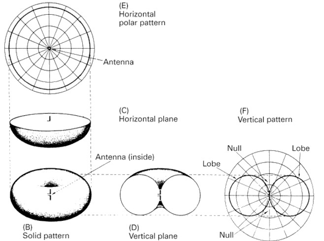
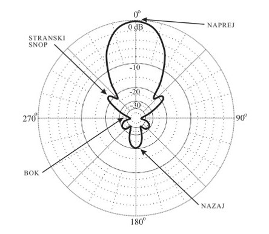
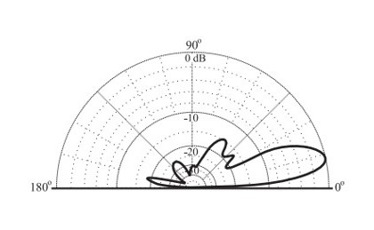
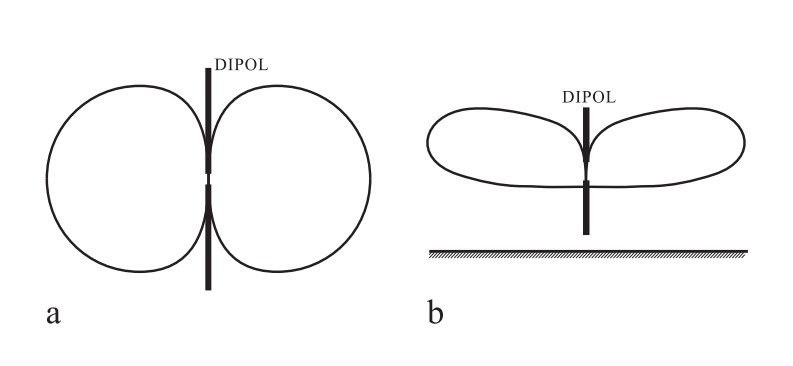
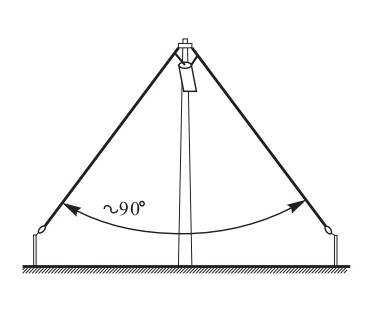
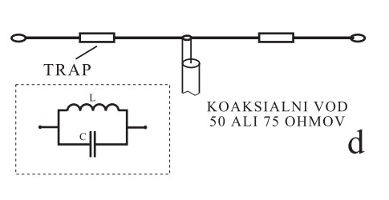
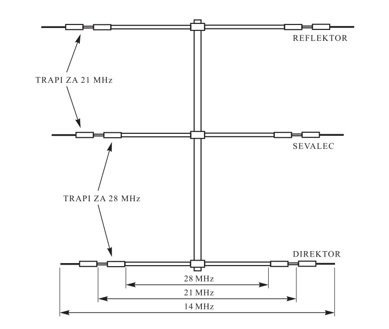
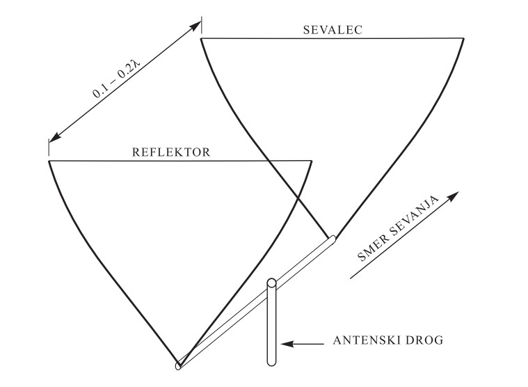
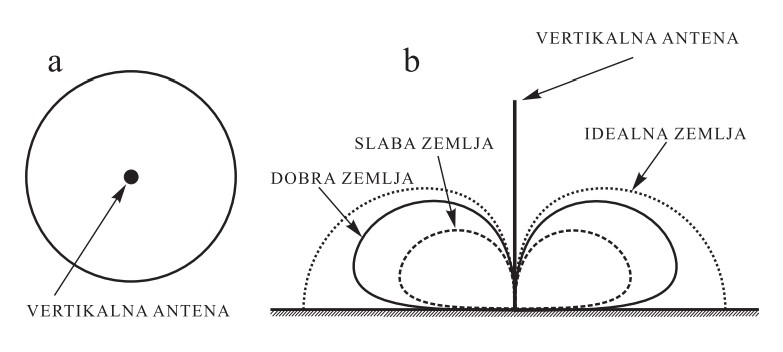
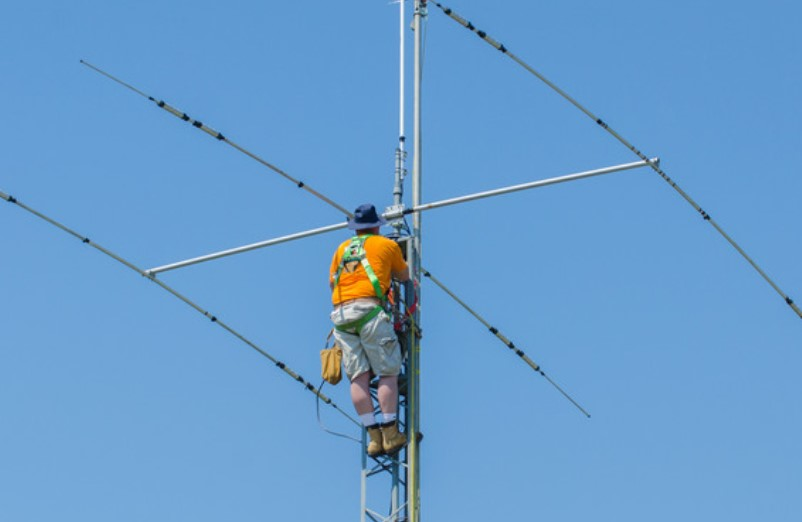

## Antene

----

### Zakaj?

>“Čas, sredstva in napor, ki smo ga vložili v izgradnjo kvalitetnega antenskega sistema, nam bodo prinesli dosti več zadovoljstva ob kvalitetnih zvezah, kot pa če bi te iste zveze dosegli z večanjem moči oddajnika.”

----

### Antena

**Kaj dela antena?**  
Električno moč iz oddajnika pretvori v **elektromagnetne valove** in jih **izzseva v prostor**.

&nbsp;

**Tudi obratno:** EM valovi, ki zadanejo anteno povzročijo nihanje elek. delcev v anteni

&nbsp;

Kaj so signali, kaj motnje?

----

### Dolžina antene

Ponovimo:

$$\lambda\ \text{(m)} = \frac{300}{f\ \text{(MHz)}}$$

Tipične resonančne dolžine: **$\bm{\frac12 \lambda}$**, $\frac14 \lambda$, $\frac34 \lambda$, $1 \lambda$

----

### Polvalni dipol

Najbolj **razširjena** in **najpreprostejša** antena

Uporablja se tudi kot sestavni del drugih anten (npr. yagi)

Referenčna antena: z njo določamo ojačanje drugih anten (več kasneje)

#### Dolžina polvalnega dipola

$$ l\ (\textrm{m}) = \frac{150}{f\ (\textrm{MHz})} \cdot k $$

$l$ – dolžina v metrih  
$f$ – frekvenca v MHz  
$k$ – faktor vitkosti

$k$ je odvisen od **razmerja valovne dolžine** in **debeline vodnika**

$$ 0.93 \lesssim k \lesssim 0.98 $$

----

### Impedanca antene

Impedanca: **Razporeditev toka in napetosti** v točki.

Napetost in tok fazno zamaknjena za 90° oz. $\frac14 \lambda$

$$ Z = \frac{U}{I} $$

Rezonančna antena: impedanca je **ohmska**

Antena **predolga**: pojavi se **induktivna reaktanca**  
Antena **prekratka**: pojavi se **kapacitivna reaktanca**

**Impedanco antene** razumemo kot impedanco **v točki napajanja**

----

### Sevalna upornost

Z njo določamo več lastnosti antene

Računa se v **točki največje amplitude toka**  
Ekvivalentna upornost, na kateri bi se porabila vsa moč oddajnika

$$ \eta = \frac{1}{ 1 + \frac{R_i}{R_s} } $$

$\eta$ – (eta) izkoristek  
$R_i$ – upornost žice  
$R_s$ – upornost sevanja

Na upornost sevanja vplivajo:  
**višina** antene, **predmeti v okolici**, kvaliteta tal, dimenzije oblika antene, &hellip;

----

### Skrajševalni faktor

Ločimo **mehansko** in **električno dolžino antene**  
_Enaki le v primeru neskončno tanke žice, v praznem prostoru_

**Faktor vitkosti**: debelejši vodnik &rArr; večja kapacitivnost  
Nihajni krog: večja kapacitivnost &rArr; nižja frekvenca  
Torej: debelejšo anteno moramo skrajšati  
Za polvalni dipol iz žice okoli 0,98

Na KV področju se pojavi še **efekt koncev** (izolator + konec žice)  
Iz prakse, najugodnejši skrajševalni faktor: 0,95

----

### Sevanje antene

**Izotropna antena:**

- Točkast izvor, seva v vse smeri enako
- V praksi je NE moremo narediti

**Usmerjenost sevanja** predstavimo s:
- 3D sliko, ali s
- horizontalnim / vertikalnim sevalnim diagramom

----

### Sevalni diagram

Horizontalni sevalni diagram

Vertikalni sevalni diagram

----

### Kot sevanja

**Širina sevanja antene v glavni smeri**

V diagramu na glavnem snopu pri **0,71** maksimalne vrednosti.  
To je 50% padec moči oz. **-3dB**.

----

### Razmerja sevanja

**F/B ratio – front to back ratio:**  
razmerje med napetostjo v smeri maksimalnega sevanja (0°) in njemu nasprotnega sevanja (180°)

**F/S ratio – front to side ratio:**  
 razmerje sevanja v direktni smeri in sevanja v bočni smeri (90°, 270°)

----

### Dobiček antene (ojačanje)

Razmerje ojačanja moči glede na referenčno anteno

$$ G = \frac{P_1}{P_2} $$

$P_1$ – moč antene, ki se troši na anteni  
$P_2$ – moč referenčne antene v istem polju

$$ G(\mathrm{dB}) = 10 \cdot \log \bigg( \frac {P_1}{P_2} \bigg) = 20 \cdot \log \bigg( \frac {U_1}{U_2} \bigg) $$

----

### Referenčne antene

**Izotropna (točkasta) antena:**  
Ojačanje merimo z **dBi – decibel glede na izotropni radiator**

**Polvalni dipol:**  
Ojačanje merimo z **dBd – decibel glede na dipol**

Ojačanje dipola glede na izotropni radiator je 2,14 dBi

----

### Efektivna izsevana moč – ERP

$$ P_\text{ERP} = G \cdot P $$

**Primer**:  
Imamo oddajnik z močjo 25 W, anteno z ojačenjem 12 dBd in napajalni kabel, v katerem imamo 2 dB izgub. Iz navedenega je razvidno, da je skupno ojačenje antenskega sistema 10 dB oziroma 10-krat.

$$ P_\text{ERP} = 10 \cdot 25 \ \mathrm{W} = 250 \ \mathrm{W} $$

"Ob uporabi dipola bi za isto efektivno moč potrebovali 250 W oddajnik."

$ P_\text{EIRP}(\mathrm{W}) = 1,64 \cdot P_\text{ERP}(\mathrm{W}) $  
$ P_\text{EIRP}(\mathrm{dB}) = P_\text{ERP}(\mathrm{dB}) + 2,15 $

----

### Praktične oblike anten

----

### Polvalni dipol

Še enkrat:

$$ l(\mathrm{m}) = \frac{150}{f(\mathrm{MHz})} \cdot k $$

Na seva na vse strani enako

Ločimo:
- horizontalni dipol
- vertikalni dipol

Če nimamo prostora lahko zavijemo konce proti tlem, to vpliva na sevalni diagram, rezonanco in impedanco antene.

Idealno postavljen **vsaj ½ "𝜆" od tal**, če ni, se popači sevalni diagram.

Vertikalni sevalni diagram  
vertikalnega dipola  
  
a) v praznem prostoru  
b) blizu tal

Horizontalni dipol

 

----

### Obrnjeni V – Inverted V

**Varianta dipola** (malenkost daljša, 5%)

- Potrebuje le eno visoko točko
- Okoli 90° (60 - 120°)
- Konci vsaj 3 m od tal (zaradi varnosti mimoidočih)

Oglašujemo jo s:

- spreminjanjem **dolžine žice** in
- spreminjanjem **naklona**

Možno napajanje večih anten različnih dolžin.

----

### Zaprt (zavit) polvalni dipol

Uporablja predvsem na UKV področju (tudi KV).  
Tudi varianta dipola – bolj **širokopasoven**.

Impedanca je okoli 300 &Omega;, to pomeni, da anteno napajamo z:

- 300 &Omega; odprtim vodom ali pa
- 50 &Omega; koaksialnim vodom z 6:1 (balunom)

----

### Dipol antene za delo na več frekvenčnih pasovih   "Multiband dipoli"

**Zepp antena**: polvalna antena, napajamo z odprtim vodom dolg $\frac14 \lambda$  
Ločimo: **Enojni** (a) in **dvojni** (b) Zepp

**Windom antena** (c): polvalna antena, napajamo na $\frac13$ dolžine antene (impedanca 300 &Omega; &rArr; 6:1 balun in koaksialni vod)

**Dvojna Windom antena**: dve anteni na istem balunu, pokrijemo več pasov

### "Trap" dipol

V antenski žici imamo **vgrajena posebna vezja**/pasti ali "trape"

Pasti so **vzporedni nihajni krogi** – pri resonanci **velika upornost**

**W3DZZ** antena: z enim parom trapov pokrije več amaterskih pasov  
To dosežemo s pravilnim razmerjem med L in C

----

### Yagi–Uda antena

Tipična predstavnica **usmerjenih** anten

**Aktivni** element: **sevalec**  
**Parazitni** elementi: **reflektor**, **direktorji**

 

**Več direktorjev** &rarr; **ožji glavni snop**  
Po določeni velikosti, ni smiselno povečevanje.

"Multiband" Yagi antena  

----

### Zančne (loop) antene

**Quad** (4) in **Delta** (3) **Loop**

Dva ali več kvadratov/trikotnikov

Sevalec (dolg &lambda;), reflektor (&lambda; + 3-5%), direktorji (&lambda; - 3-5%)

Razmik približno 0,2 &lambda;

Nižji vertikalni kot sevanja na majhnih višinah  
Manj občutljive na šum  
Slabša odpornost na vreme

KV – prevladujejo loop, UKV – yagi

----

### Logaritmično – periodične dipol antene (LPDA)   "log-periodik" (LP)

Najpogostejše za TV sprejemnike

Pokrivajo **širok frekvenčni pas**, konstantno obnašanje

Najdaljši in najkrajši določata zgornjo in spodnjo mejo frekvenčnega pasu

Razmiki določajo ojačanje antene

**Napaja na sprednjem delu**

Predolgi – reflektorji, prekratki – direktorji

----

### Long – wire antena (LW)

Ko nimamo prostora za polvalni dipol ali usmerjeno anteno

Žica postavljena čim višje, ne nujno v ravni liniji

**Moramo** uporabljati **prilagoditveno vezje** (prilagodimo impedanco)

Idealna dolžina je nekaj valovnih dolžin

Na najnižji frekvenci mora biti dolga vsaj $\frac34 \lambda$

----

### Vertikalne antene

Malo prostora, delo iz vozila, ročne postaje

**Dobro narejena** in primerno **ozemljena**!

Horizontalno seva v vse smeri enako ("omnidirekcionalna"), vertikalno precej usmerjena

Polovica vertikalnega dipola ($\frac14 \lambda$), druga polovica je zemlja pod anteno

Ozemljimo z **radiali** (na ali pod zemljo) 0,2 - 0,5 &lambda;

Na KV pogosto dodamo "trape"

$\frac14 \lambda$ najbolj razširjena,  
**AMPAK** optimalni kot sevanja dosežemo z **$\bf{\frac58 \lambda}$**

Problemi: **ni napajalnih vodov** s pravilno impedanco in antena **ni resonančna** (kapacitivna)

Pomagamo si s tuljavo pri vznožju

Oddaja: odlična  
Sprejem: **več šuma** kot horizontalne

#### Ground plane – GP antene

Vertikalna antena postavljena visoko nad zemljo – potrebujemo "**umetno zemljo**" ali "ground plane"

Radiali – žica (KV) ali aluminjaste cevi

----

### Parabolična antena

Predvsem na UHF in SHF

Zakaj? Na 144MHz je premer reflektorja okoli 15m

Reflektor – "**parabolično zrcalo**"  
**Sevalec** – **v gorišču**

Sevalci različnih oblik – z menjavo, različni frekvenčni pasovi

**VELIKO ojačanje** in **ozek kot sevanja**

Satelitske in EME (lahko tudi tropo) zveze

----

### Umetna antena

**Ne seva** energije v prostor

Upori primerne moči

Predstavljajo popolnoma prilagojeno breme

**Uglaševanje in testiranje** oddajnikov

----

### Postavljanje anten

**VARNOST!!**

----

## Napajanje anten

🚧 Under construction 🚧

----

### Antenski / napajalni vod

Poveže anteno in oddajnik  
Največji prenos moči: končna stopnja oddajnika in antena **impedančno prilagojena**

Vod **ne sme sevati**, **energija** pri prenosu **se ne sme izgubiti**, mora imeti **konstantne električne karakteristike**, in mora biti odporen na **vreme**

----

### Vrste antenskih vodov

Dve glavni vrsti: **dvožilni** in **koaksialni** vod  
**Valovod** – cev ustreznega preseka (za mikrovalovno področje)

----

### Karakteristična impedanca voda (Z)

Razmerje napetosti U in toka I na neskončno dolgem vodniku  
Impedanca (zrak): Z = $\sqrt{ \frac{L}{C} }$  
L – "debelina vodnika"  
C – "medsebojna razdalja"

Dvožilni antenski vod:

TODO FIXX

$$ Z(\Omega) = \frac{120}{ \sqrt{ξ_r} }$ \cdot \ln $\frac{2D(mm)}{d(mm)} $$

Koaksialni vod:

$$ Z(\Omega) = \frac{60}{ \sqrt{ξ_r} }$ \cdot \ln $\frac{D(mm)}{d(mm)} $$

----

### Vpliv dielektrika

Hitrost širjenja valovanja v snovi:

v = $ \frac{c}{\sqrt{ξ_r}}$

v – hitrost v snovi ($\frac{km}{s}$)  
c – hitrost svetlobe (300000 $\frac{km}{s}$)  
ξ r – relativna dielektrična konstanta

Skrajševalni faktor koaksialnega voda:

V = $ \frac{v}{c}$ = $ \frac{1}{\sqrt{ξ_r}}$

----

### Izgube v napajalnih vodih

**Izgube** zaradi ohmske **upornosti žice** (skin efekt), **izgube v dielektriku** in **sevanja voda**  “Nobody’s perfect” (Hannah Montana, 2007) 

----

### Porazdelitev toka in napetosti vzdolž voda – Stojno valovanje

----

### Razmerje stojnega valovanja (SWR)

"Standing wave ratio"

SWR = $\frac{U_(max)}{U_(min)}$

Merimo s **SWR metrom**  
Slab SWR:

- Izgube / gretje / poškodbe na antenskem vodu
- Manjša izsevana moč
- **Poškodba končne stopnje** na oddajniku!
- Dopustna meja: SWR = 3 (25% moči)

----

### Elementi za prilagoditev in transformacijo

**Gama**: s kratkostično objemalko in spremenljivim kondenzatorjem prilagajamo SWR  
**Delta**: priključne žice na sredino dipola, sredino lahko ozemljimo  
**"Hairpin"**: Lažje kot gama, ampak mora sevalec biti prekinjen in v primeru koaksa potreben člen za simetriranje (balun)

----

### Elementi za prilagoditev in transformacijo Transformatorji impedance

Zv – vhodna impedanca  
Zi – izhodna impedanca

Transformira impedanco 4:1  
Omogoča simetriranje

Upoštevamo skrajševalni faktor voda!

----

### Transformatorji za simetriranje

Polvalni dipol (simetrični) -?- koaksialni vod (nesimetrični)  
Balun (**bal**anced-**un**balanced) – prehod, simetrično na nesimetrično

In še mnogo več…

----

### Antenski tunerji

----

### Napajalni vod kot element za uglaševanje

