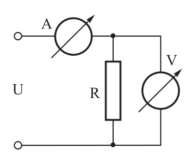

## Motnje

🚧 Under construction 🚧

----

### Vzroki za nastanek in ukrepi za preprečevanje

**Antene**  
Napajanje z oklopljenim antenskim vodom &rarr; manj sevanja v okolico

**Priključek na električno omrežje**  
Motnje iz električnega omrežja lahko odpravimo z vgradnjo filtrov in dušilk

**Parazitne oscilacije** (višji harmoniki)  
Da zmanjšamo pojav, pazimo na pravilno gradnjo oddajnikov, ojačevalnikov in anten

**Motnje zaradi intermodulacijskih popačenj**  
Premočni signali &rarr; sprejemnik pride v nelinearno območje

**Preprečevanje motenj**  
Oklapljanje in blokiranje vseh delov naprav, ki generirajo neželeno VF energijo

----

### Vrste motenj

**Radijske motnje** (RFI – Radio Frequency Interference):  
radioamaterska postaja lahko vzrok ali žrtev  
Radijski šum je posledica iskrenja, razelektritev, delovanja elektičnih strojev, ...

&nbsp;

**Televizijske motnje** (TVI – Television Interference):  
preobremenitev sprejemnika, ko je oddajna antena preblizu televizijski anteni

&nbsp;

**Druge vrste motenj**  
Motnje zaradi predolgih (audio/video) kablov (delujejo kot antene)

----

## Meritve

----

### Merjenje napetosti

**Voltmeter** priključimo **vzporedno** z bremenom

Upornost voltmetra podajamo v omih na volt (**&Omega;/V**),  
**želimo večjo notranjo upornost** (digitalni voltmetri),  
s tem manj vpliva na rezultat meritve

&nbsp;

$$ U_v = U \cdot \frac{R_N}{R_1 + R_N} \qquad R_N = \frac{R_B \cdot R_V}{R_B + R_V} $$

$U_v$ – izmerjena napetost  
$R_N$ – nadomestna upornost ($R_B$, $R_V$)

----

### Merjenje toka

**Ampermeter** priključimo **zaporedno** bremenu

**Želimo čim nižjo notranjo upornost**

$$ I = \frac{U}{R_A + R_B} $$

$R_A$ – upornost ampermetra

----

### Merjenje upornosti

TODO: Merjenje moči, merjenje swr, merjenje oblike VF signala, merjenje frekvence

----

### Merilni inštrumenti

Inštrument z vrtljivo tuljavico  

----

### Napake pri meritvah

**Netočnost inštrumenta**:  
Napake se pojavijo tako zaradi težavnosti odčitavanja, kakor tudi zaradi občutljivosti inštrumenta, merilnih pogojev, vgrajenih elementov in ostalega… Merilni napaki pravimo tudi pogrešek.

**Vpliv frekvence**:  
Merjenje enosmernih veličin ni problematično. Pri izmeničnih veličinah lahko frekvenca vpliva na meritev toka ali napetosti, saj vemo, da so vsi instrumenti frekvenčno omejeni in lahko merijo signale do neke maksimalne frekvence.

**Vpliv notranje upornosti inštrumentov**:  
Notranja upornost voltmetra vpliva na meritev napetosti, prav tako notranja upornost ampermetra.

**Vpliv oblike merjene napetosti**:  
Prav tako tudi oblika napetosti vpliva na meritev veličin, ponavadi imamo inštrumente, ki merijo sinusno napetost oz. tok

----

## Varstvo pri delu

Nevarnost pri delu z električnim tokom: izogibajmo se napetostim, višjim od 50 V, ki so že lahko nevarne!

Nevarnost VF energije: Nikoli se ne dotikajmo naprav v obratovanju! Pri
visokih oddajnih močeh lahko pride do opeklin kože. Opekline lahko zaznamo že pri 10 W. Pri 1500 W oddajniku se na priključnih sponkah antene pojavi napetost:

$$ U = \sqrt{P \cdot R} = \sqrt{1500\ \mathrm{W} \cdot 50\ \Omega} = 273\ \mathrm{V} $$

Nikoli ne glejmo v usmerjene antene, saj so oči slabo prekrvavljene in lahko pride do trajnih posledic

#### Nevarnost udara strele

Dobra ozemljitev zmanjša verjetnost nastanka motenj

----

