## Motnje

🚧 Under construction 🚧

----

### Vzroki za nastanek in ukrepi za preprečevanje

**Antene**  
Napajanje z oklopljenim antenskim vodom &rarr; manj sevanja v okolico

**Priključek na električno omrežje**  
Motnje iz električnega omrežja lahko odpravimo z vgradnjo filtrov in dušilk

**Parazitne oscilacije** (višji harmoniki)  
Da zmanjšamo pojav, pazimo na pravilno gradnjo oddajnikov, ojačevalnikov in anten

**Motnje zaradi intermodulacijskih popačenj**  
Premočni signali &rarr; sprejemnik pride v nelinearno območje

**Preprečevanje motenj**  
Oklapljanje in blokiranje vseh delov naprav, ki generirajo neželeno VF energijo

----

### Vrste motenj

**Radijske motnje** (RFI – Radio Frequency Interference):  
radioamaterska postaja lahko vzrok ali žrtev  
Radijski šum je posledica iskrenja, razelektritev, delovanja elektičnih strojev, &hellip;

&nbsp;

**Televizijske motnje** (TVI – Television Interference):  
preobremenitev sprejemnika, ko je oddajna antena preblizu televizijski anteni

&nbsp;

**Druge vrste motenj**  
Motnje zaradi predolgih (audio/video) kablov (delujejo kot antene)

----

## Meritve

----

### Napake pri meritvah

Merilni napaki pravimo tudi pogrešek

**Netočnost inštrumenta**:  
Zaradi težavnosti odčitavanja, občutljivosti inštrumenta, merilnij pogojev, vgrajenih elementov in ostalega &hellip;

**Vpliv frekvence**:  
Pri izmeničnih veličinah lahko frekvenca vpliva na meritev toka ali napetosti. Vsi inštrumenti so frekvenčno omejeni in lahko merijo signale do neke maksimalne frekvence.

**Vpliv notranje upornosti inštrumentov**:  
Notranja upornost voltmetra/ampermetra vpliva na meritev napetosti/toka.

**Vpliv oblike merjene napetosti**:  
Tudi oblika napetosti vpliva na meritev veličin, ponavadi imamo inštrumente, ki merijo sinusno napetost oz. tok

----

### Merjenje napetosti

**Voltmeter** priključimo **vzporedno** z bremenom

Upornost voltmetra podajamo v omih na volt (**&Omega;/V**),  
**želimo večjo notranjo upornost** (digitalni voltmetri),  
s tem manj vpliva na rezultat meritve

&nbsp;

$$ U_v = U \cdot \frac{R_N}{R_1 + R_N} \qquad R_N = \frac{R_B \cdot R_V}{R_B + R_V} $$

$U_v$ – izmerjena napetost  
$R_N$ – nadomestna upornost ($R_B$, $R_V$)

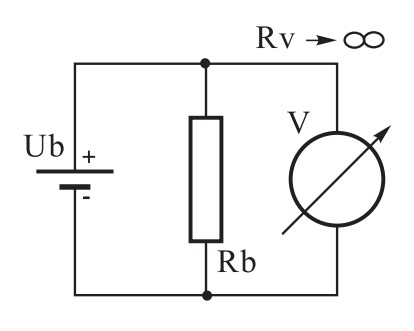

----

### Merjenje toka

**Ampermeter** priključimo **zaporedno** bremenu

**Želimo čim nižjo notranjo upornost**

$$ I = \frac{U}{R_A + R_B} $$

$R_A$ – upornost ampermetra

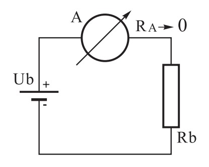
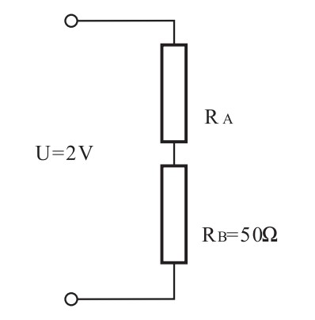

----

### Merjenje upornosti

$$ R = \frac{U}{I} $$

Posredno merjenje upornosti  

Merjenje upornosti z **ohmmetrom**  

----

### Merjenje moči

$$ P = U \cdot I \qquad P = U \cdot I \cdot \cos(\varphi) $$

Če želimo prave podatke o moči,  
moramo pravilno obremeniti izhod (50 &Omega;)

Želimo &phi; čim bližje 0°

Posredno merjenje moči  

----

### Merjenje stojnega valovanja

Uporabimo **reflektometer** oz. SWR meter

$$ \text{SWR} = \frac{U_\text{max}}{U_\text{min}} $$

SWR: 1,0  
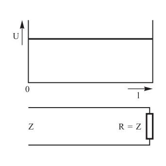

SWR: > 1,0  

----

### Merjenje oblike VF signala

Uporabimo **osciloskop**

Amplitudna modulacija  

----

### Merjenje frekvence

Več možnosti:
- Štejemo število impulzov v določenem času $ f = \frac{N}{T} $
- Uporabimo VF indikator
    - Nihajni krog, ki ga nastavimo na določeno frekvenco
- Uporabimo Grid-Dip meter
    - Meri frekvenco pasivnih nihajnih krogov, kondenatorjev, tuljav

----

### Merilni inštrumenti

#### Inštrument z vrtljivo tuljavico  

Tok skozi navitje povzroči zaskuk zaradi magnetnega polja

Proti magnetni sili deluje sila vzmeti

Lahko teče le majhen tok (50 &mu;A)

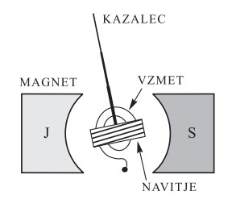

Da zmanjšamo tok / napetost skozi tuljavico, vežemo dodatni soupor / predupor odvisno od maksimalne vrednosti, ki jo želimo meriti

Soupor  
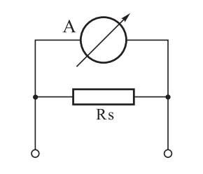

Predupor  

Merjenje upornosti  
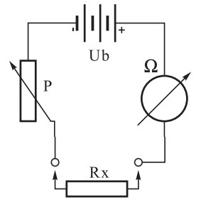

----

### Multimeter

Multimeter – merilnik, ki meri več različnih veličin

AVO meter – Amper Volt Ohm meter

Analogni multimeter  
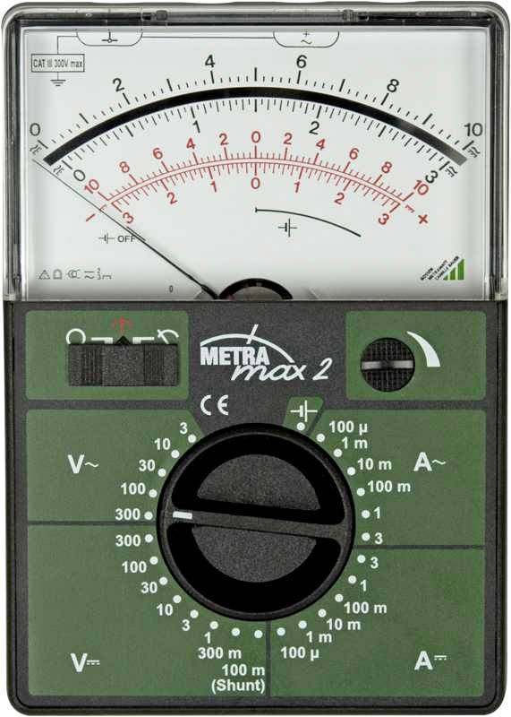

Digitalni multimeter  

----

### Reflektometer

Merilec odbitih (reflektiranih) valov

Odbojnost lažje izmerimo kot impedanco bremena

Vrednosti od 0 (popolnoma prilagojeno) do 1 (popolnoma neprilagojeno)

$$ \Gamma = \frac{Z - Z_0}{Z + Z_0} $$

$Z$ – impedanca bremena  
$Z_0$ – referenčna impedanca (50 &Omega;)  
$\Gamma$ (Gama) – velikost odbojnosti

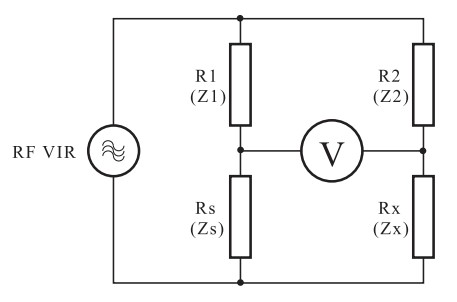

#### SWR meter

Valovitost (SWR) – razmerje stojnega vala

Vrednosti od 1 (popolnoma prilagojeno) do &infin; (popolnoma neprilagojeno)

$$ \text{SWR} = \frac{1 + \Gamma}{1 - \Gamma} $$

----

### Frekvenčni merilnik

Števec frekvence  

Frekvenčni indikator  

#### GRID-DIP meter

Merimo:
- **Resonančno frekvenco** nihajnega kroga
- **Kapacitivnost** kondenzatorja
- **Induktivnost** tuljave

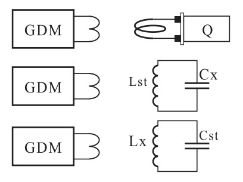

----

### Osciloskop

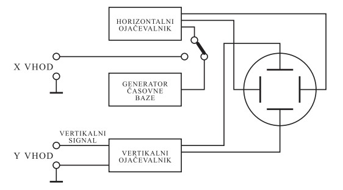
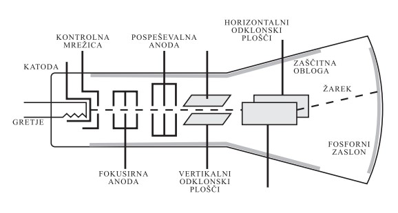

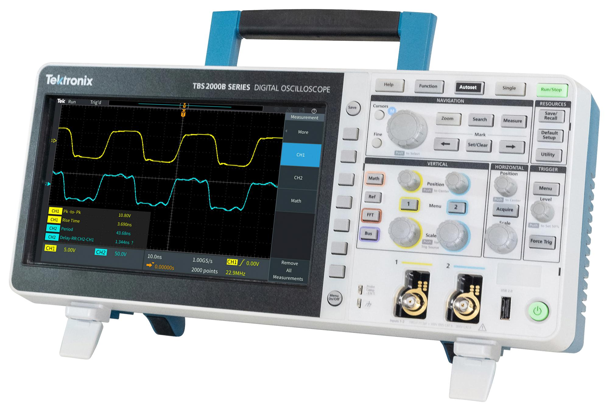

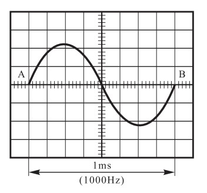

$$ f = \frac{1}{T} = \frac{1}{1000\ \mathrm{s}} = 1000\ \mathrm{Hz} $$

----

## Varstvo pri delu

Nevarnost pri delu z električnim tokom: izogibajmo se napetostim, višjim od 50 V, ki so že lahko nevarne!

Nevarnost VF energije: Nikoli se ne dotikajmo naprav v obratovanju! Pri
visokih oddajnih močeh lahko pride do opeklin kože. Opekline lahko zaznamo že pri 10 W. Pri 1500 W oddajniku se na priključnih sponkah antene pojavi napetost:

$$ U = \sqrt{P \cdot R} = \sqrt{1500\ \mathrm{W} \cdot 50\ \Omega} = 273\ \mathrm{V} $$

Nikoli ne glejmo v usmerjene antene, saj so oči slabo prekrvavljene in lahko pride do trajnih posledic

#### Nevarnost udara strele

Dobra ozemljitev zmanjša verjetnost nastanka motenj

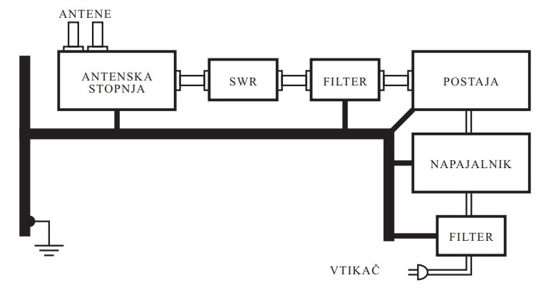
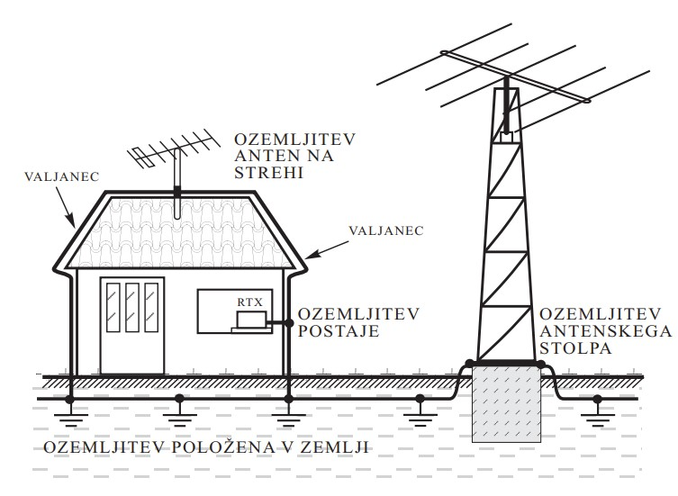

#### Primeri vprašanj

Kaj naredimo z varovalko, ki je pregorela?

a) Varovalko zamenjamo z novo, ki je predvidena za večji tok  
b) Varovalko premostimo s kosom žičke  
c) Varovalko zamenjamo z novo, ki je predvidena za isti tok

&nbsp;

Pred odpiranjem usmernika, ki deluje pri napetosti 220 V, moramo:

a) izključiti stikalo usmernika  
b) iz usmernika odstraniti varovalko  
c) dovodni 220 V omrežni kabel izključiti iz omrežja

----

